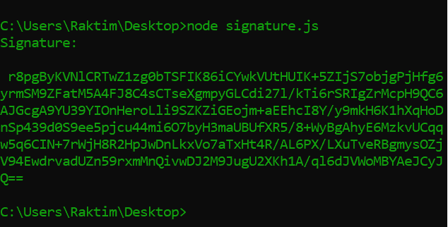
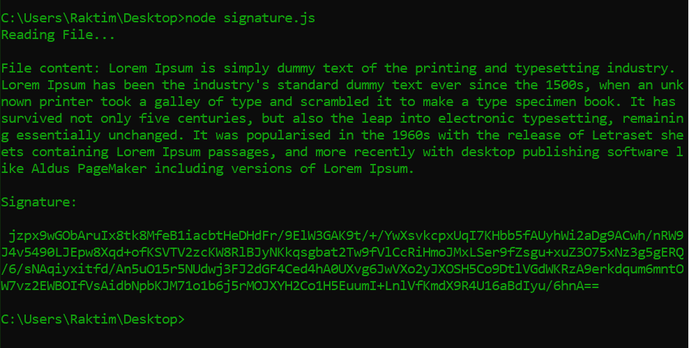
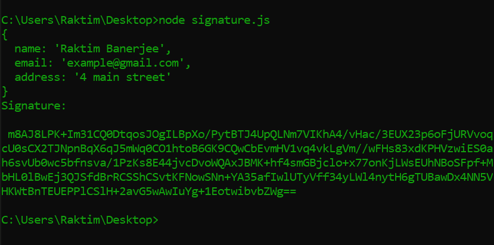

# Node.js 密码符号()函数

> 原文:[https://www.geeksforgeeks.org/node-js-crypto-sign-function/](https://www.geeksforgeeks.org/node-js-crypto-sign-function/)

加密是将纯文本转换为不可读文本的过程，该文本由文本进行哈希运算，反之亦然，并且 **crypto.sign()** 用于创建数据签名。

**语法:**

```
crypto.sign(algorithm, data, key)
```

**参数:**该功能接受以下参数:

*   **算法:**是字符串类型的值。签名可以通过应用签名算法的名称来创建，如“ **SHA256** ”来代替摘要算法。
*   **数据:**应该是**缓冲区、TypedArray 或 DataView** 的对象。读取 [Buffer.from()方法](https://www.geeksforgeeks.org/node-js-buffer-from-method/)将字符串转换为 Buffer。
*   **键:**应该是**键对象**的**私键**。如果您没有任何私钥，那么您可以使用 [crypto.generateKeyPairSync()方法创建私钥和公钥。](https://www.geeksforgeeks.org/node-js-crypto-generatekeypairsync-method/)

**模块安装:**使用以下命令安装所需的模块:

```
npm install crypto
```

**返回值:**返回基于指定算法的签名值，数据&键。返回值默认为缓冲区，但是可以使用 [buffer.toString()方法](https://www.geeksforgeeks.org/node-js-buffer-tostring-method/)转换为其他格式。

**例 1:** 在字符串上签名。

## signature.js

```
const crypto = require('crypto');
const buffer = require('buffer');

// Create a private key
const { privateKey, publicKey } = crypto.generateKeyPairSync('rsa', {
  modulusLength: 2048,
});

// Convert string to buffer 
const data = Buffer.from("I Love GeeksForGeeks");

// Sign the data and returned signature in buffer 
const sign = crypto.sign("SHA256", data , privateKey);

// Convert returned buffer to base64
const signature = sign.toString('base64');

// Printing the signature 
console.log(`Signature:\n\n ${signature}`);
```

使用以下命令运行**签名. js** 文件:

```
node signature.js
```

**输出:**



**例 2:** 签署文件。

## signature.js

```
const crypto = require('crypto');
const buffer = require('buffer');
const fs = require('fs');

// Create a private key
const { privateKey } = crypto.generateKeyPairSync('rsa', {
  modulusLength: 2048,
});

console.log("Reading File...\n");
// Reading file
const text = fs.readFileSync('./doc.txt');
console.log(`File content: ${text}`);

// Convert string to buffer 
const data = Buffer.from(text);

// Sign the data and returned signature in buffer 
const sign = crypto.sign("SHA256", data , privateKey);

// Convert returned buffer to base64
const signature = sign.toString('base64');

// Printing the signature 
console.log(`Signature:\n\n ${signature}`);
```

使用以下命令运行**签名. js** 文件:

```
node signature.js
```

**输出:**



**例 3:** 签署 JSON 数据。

## signature.js

```
const crypto = require('crypto');
const buffer = require('buffer');

// Create a private key
const { privateKey } = crypto.generateKeyPairSync('rsa', {
  modulusLength: 2048,
});

// JSON object
const person = {
    name: "Raktim Banerjee",
    email:"example@gmail.com",
    address: "4 main street"
}

// Convert Stringified json data to buffer  
const data = Buffer.from( JSON.stringify(person) );

// Sign the data and returned signature in buffer 
const sign = crypto.sign("SHA256", data , privateKey);

// Convert returned buffer to base64
const signature = sign.toString('base64');

// Printing the signature 
console.log(`Signature:\n\n ${signature}`);
```

使用以下命令运行**签名. js** 文件:

```
node signature.js
```

**输出:**



**参考:**[https://nodejs . org/API/crypto . html # crypto _ crypto _ sign _ algorithm _ data _ key _ callback](https://nodejs.org/api/crypto.html#crypto_crypto_sign_algorithm_data_key_callback)