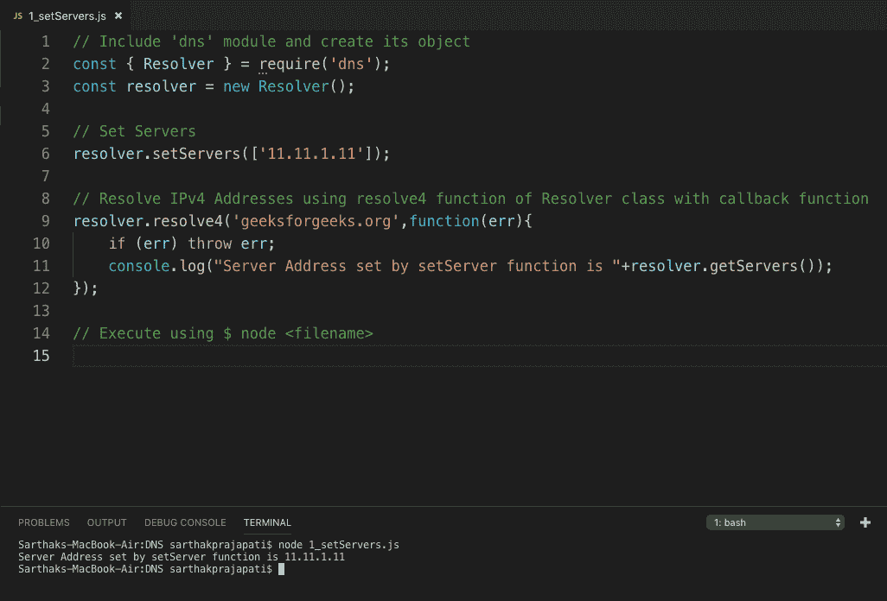
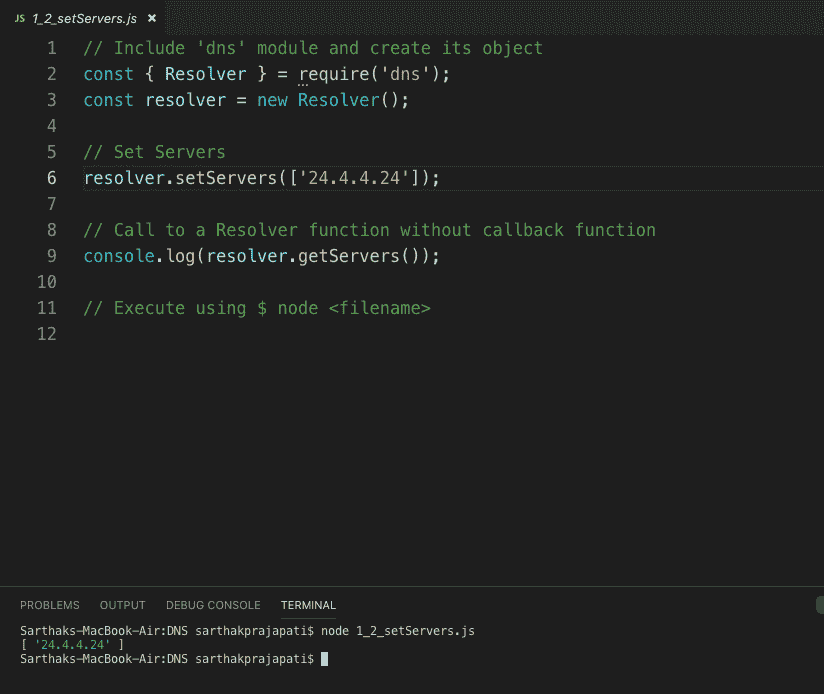

# Node.js DNS setServers()

> 原文:[https://www.geeksforgeeks.org/node-js-dns-setservers/](https://www.geeksforgeeks.org/node-js-dns-setservers/)

setServers()函数是 node.js Resolver 类中的一个内置函数，用于设置执行 DNS 解析时要使用的服务器的 IP 地址和端口。服务器的参数是一组 **RFC 5952** 格式的地址。如果在回调函数的帮助下提供了无效地址，将会引发错误。

**语法:**

```js
dns.setServers(array );
```

**示例:**

```js
dns.setServers([
  '4.4.4.4',
  '[2001:4860:4860::8888]'
]);
```

**参数:**该函数接受一个参数作为格式为 **rfc5952** 的数组字符串。
**返回值:**该函数成功返回未定义对象。

**例 1:带回拨功能**

```js
// Include 'dns' module and create its object 
const { Resolver } = require('dns');
const resolver = new Resolver();

// Set Servers
resolver.setServers(['11.11.1.11']);

// Resolve IPv4 Addresses using resolve4 
//function of Resolver class with callback function
resolver.resolve4('geeksforgeeks.org', function(err){
    if (err) throw err;
    console.log("Server Address set by setServer function is "
                 +resolver.getServers());
});

// Execute using $ node  
```

**输出:**


**例 2:无回拨功能**

```js
// Include 'dns' module and create its object 
const { Resolver } = require('dns');
const resolver = new Resolver();

// Set Servers
resolver.setServers(['24.4.4.24']);

// Call to a Resolver function without callback function
console.log(resolver.getServers());

// Execute using $ node  
```

**输出:**


**参考:**[https://nodejs . org/docs/latest-v9 . x/API/DNS . html # DNS _ DNS _ setservers _ servers](https://nodejs.org/docs/latest-v9.x/api/dns.html#dns_dns_setservers_servers)