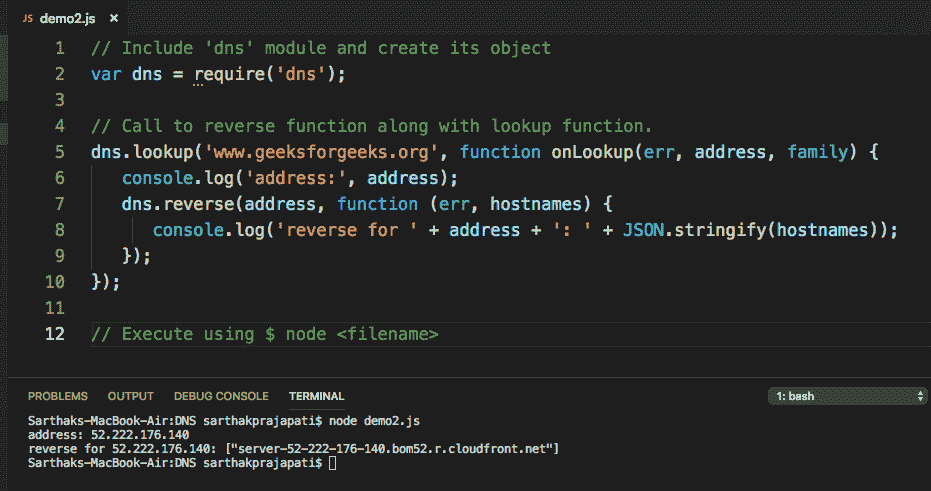

# Node.js DNS

> 原文:[https://www.geeksforgeeks.org/node-js-dns/](https://www.geeksforgeeks.org/node-js-dns/)

# 导言:

域名系统是一个节点模块，用于操作系统提供的名称解析工具，也用于实际的域名系统查找。

**优势**
无需记忆 IP 地址——DNS 服务器提供了一个将域名或子域名称转换为 IP 地址的巧妙解决方案。

**例 1:**

```
// Include 'dns' module and create its object
const dns = require('dns');

const website = 'geeksforgeeks.org';
// Call to lookup function of dns
dns.lookup(website, (err, address, family) => {
  console.log('address of %s is %j family: IPv%s', 
           website, address, family);
});

// Execute using $ node <filename>
```

**输出:**


```
address of geeksforgeeks.org is "52.25.109.230" family: IPv4

```

**例 2:**

```
// Include 'dns' module and create its object
var dns = require('dns');

// Call to reverse function along with lookup function.
dns.lookup('www.geeksforgeeks.org', 
     function onLookup(err, address, family) {
    console.log('address:', address);
    dns.reverse(address, function (err, hostnames) {
      console.log('reverse for ' + address + ': ' 
             + JSON.stringify(hostnames));
   });  
});

// Execute using $ node <filename>
```

**输出:**


```
address: 52.222.176.140
reverse for 52.222.176.140: ["server-52-222-176-140.bom52.r.cloudfront.net"]

```

**参考:**T2[https://nodejs.org/docs/latest-v9.x/api/dns.html#dns_dns](https://nodejs.org/docs/latest-v9.x/api/dns.html#dns_dns)