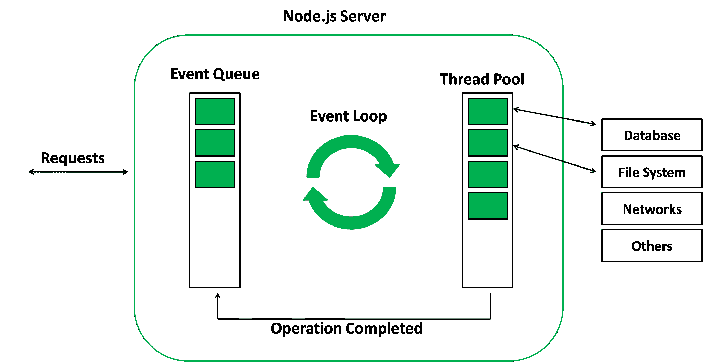

# Node.js 事件循环

> 原文:[https://www.geeksforgeeks.org/node-js-event-loop/](https://www.geeksforgeeks.org/node-js-event-loop/)

Node.js 是一个单线程事件驱动平台，能够运行非阻塞异步编程。Node.js 的这些功能使它具有内存效率。**事件循环**允许 Node.js 执行非阻塞 I/O 操作，尽管 JavaScript 是单线程的。这是通过随时随地向操作系统分配操作来实现的。

大多数操作系统都是多线程的，因此可以处理在后台执行的多个操作。当这些操作之一完成时，内核告诉 Node.js，分配给该操作的相应回调被添加到最终将被执行的事件队列中。这将在本主题后面进一步详细解释。

**事件循环的特征:**

*   事件循环是一个无休止的循环，它等待任务，执行任务，然后休眠，直到接收到更多的任务。
*   事件循环仅在调用堆栈为空(即没有正在进行的任务)时执行事件队列中的任务。
*   事件循环允许我们使用回调和承诺。
*   事件循环从最早的开始执行任务。

**示例:**

```js
console.log("This is the first statement");

setTimeout(function(){
    console.log("This is the second statement");
}, 1000);

console.log("This is the third statement"); 
```

**输出:**

```js
This is the first statement
This is the third statement
This is the second statement
```

**说明:**上例中，第一条控制台日志语句被推送到调用栈，在控制台上记录“这是第一条语句”，任务从栈中弹出。接下来，setTimeout 被推入队列，任务被发送到操作系统，并为任务设置计时器。然后从堆栈中弹出该任务。接下来，第三条控制台日志语句被推送到调用堆栈，并且“这是第三条语句”被记录在控制台上，并且任务从堆栈中弹出。

当 setTimeout 函数设置的定时器(本例中为 1000 ms)用完时，回调被发送到事件队列。发现调用堆栈为空时的事件循环将任务置于事件队列的顶部，并将其发送到调用堆栈。setTimeout 函数的回调函数运行指令，控制台上记录“这是第二条语句”，任务从堆栈中弹出。

> **注意:**在上述情况下，如果超时设置为 0 毫秒，那么语句也将以相同的顺序显示。这是因为尽管回调会立即发送到事件队列，但事件循环不会将其发送到调用堆栈，除非调用堆栈为空，即直到提供的输入脚本结束。

**事件循环的工作:**当 Node.js 启动时，它初始化事件循环，处理提供的可能进行异步 API 调用的输入脚本，调度定时器，然后开始处理事件循环。在前面的例子中，初始输入脚本由 console.log()语句和调度计时器的 setTimeout()函数组成。

使用 Node.js 时，使用一个名为 libuv 的特殊库模块来执行异步操作。该库还与 Node 的后台逻辑一起用于管理一个称为 libuv 线程池的特殊线程池。这个线程池由四个线程组成，用于委托对于事件循环来说太重的操作。输入/输出操作、打开和关闭连接、设置超时就是这类操作的例子。

当线程池完成一项任务时，会调用一个回调函数来处理错误(如果有的话)或执行一些其他操作。这个回调函数被发送到事件队列。当调用堆栈为空时，事件将通过事件队列，并将回调发送到调用堆栈。

下图是 Node.js 服务器中事件循环的恰当表示:


**事件循环的阶段:**下图显示了事件循环操作顺序的简化概述:


*   **定时器:**在此阶段执行 setTimeout()或 setInterval()调度的回调。
*   **待定回调:**延迟到下一次循环迭代的 I/O 回调在这里执行。
*   **闲置，准备:**仅供内部使用。
*   **轮询:**检索新的输入/输出事件。
*   **检查:**它调用 setIntermediate()回调。
*   **关闭回调:**处理一些关闭回调。例如:socket.on('close '，…)