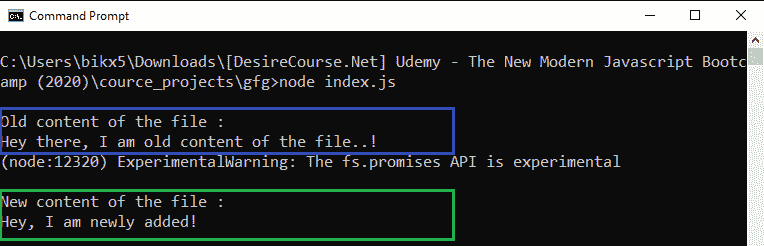
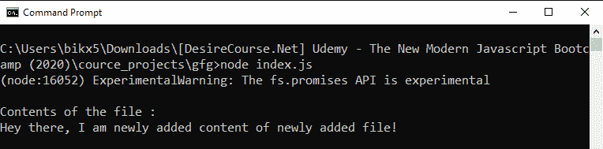

# Node.js filehandle.writeFile()方法来自类:FileHandle

> 原文:[https://www . geesforgeks . org/node-js-file handle-write file-method-from-class-file handle/](https://www.geeksforgeeks.org/node-js-filehandle-writefile-method-from-class-filehandle/)

**filehandle.writeFile()** 方法是用来在 Node.js 的 File System 模块中定义的，File System 模块基本上就是和用户电脑的硬盘进行交互。fs.writeFile()方法将数据异步写入文件，如果文件已经存在，则替换该文件。

**语法:**

```js
filehandle.writeFile(data, options)
```

**参数:**该方法接受两个参数，如上所述，如下所述:

*   **数据:**是字符串、缓冲区或 Uint8Array 实例。它是将要写入文件的数据。
*   **选项:**它是一个可选参数，以某种方式影响输出，因此我们是否将其提供给函数调用。
    *   **编码:**是指定编码技术的字符串，默认值为‘utf8’。

**示例 1:** 本示例说明如何对已经存在的文件进行写操作。

```js
// Node.js program to demonstrate the
// filehandle.writeFile() Method

// Importing File System and Utilities module
const fs = require('fs')

// The readFileSync() method reads the
// contents of the file and returns the
// buffer form of the data
const oldBuff = fs.readFileSync('./tesTfile.txt')
const oldContent = oldBuff.toString()
console.log(`\nOld content of the file :\n${oldContent}`)

const writeToFile = async (path, data) => {
    let filehandle = null

    try {
        filehandle = await fs.promises.open(path, mode = 'w')
        // Write to file
        await filehandle.writeFile(data)
    } finally {
        if (filehandle) {
            // Close the file if it is opened.
            await filehandle.close();
        }
    }
    // New content after write operation
    const newBuff = fs.readFileSync('./tesTfile.txt')
    const newContent = newBuff.toString()
    console.log(`\nNew content of the file :\n${newContent}`)
}

writeToFile('./testFile.txt', "Hey, I am newly added!")
    .catch(err => {
        console.log(`Error Occurs, Error code -> 
            ${err.code}, Error NO -> ${err.errno}`)
    })
```

**输出:**


**示例 2:** 这个示例解释了如何对先前不存在但在运行时创建的文件执行写操作。

```js
// Node.js program to demonstrate the
// filehandle.writeFile() Method

// Importing File System and Utilities module
const fs = require('fs')

const writeToFile = async (path, data) => {
    let filehandle = null

    try {
        filehandle = await fs
            .promises.open(path, mode = 'w')
        // Write to file
        await filehandle.writeFile(data)
    } finally {
        if (filehandle) {
            // Close the file if it is opened.
            await filehandle.close();
        }
    }
    // The readFileSync() method reads
    // the contents of the file and 
    // returns the buffer form of the data
    const buff = fs.readFileSync(path)
    const content = buff.toString()
    console.log(`\nContents of the file :\n${content}`)
}

var query = "Hey there, I am newly added "
        + "content of newly added file!";
writeToFile('./testFile.txt', query)
    .catch(err => {
        console.log(`Error Occurs, Error code -> 
        ${err.code}, Error NO -> ${err.errno}`)
    })
```

**运行程序前的目录结构:**


**运行程序后的目录结构:**


**输出:**
