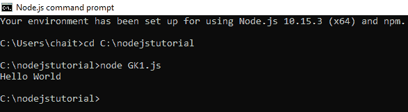
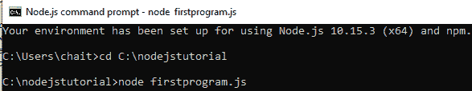
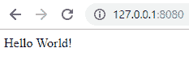

# Node.js 首次应用

> 原文:[https://www.geeksforgeeks.org/node-js-first-application/](https://www.geeksforgeeks.org/node-js-first-application/)

Node.js 是一个开源的、跨平台的服务器环境，使用 V8 JavaScript Engine 执行 JavaScript。Node.js 有助于用同一种语言编写前端和后端代码。它有助于为实时应用程序编写高效的代码。在 Node.js 中，可以使用基于控制台的方法或基于 web 的方法编写应用程序。

**基于控制台的 Node.js 应用程序:**基于 Node.js 控制台的应用程序使用 Node.js 命令提示符运行。Node.js 中的控制台模块提供了一个简单的调试控制台。Node.js 是一个全局控制台，可用于同步和异步通信。console.log()函数用于在控制台上显示输出。这个函数用换行符将输出打印到 stdout。

**语法:**

```js
console.log([data][, ...]);
```

这里，数据是要在控制台上显示的内容。

**示例 1:** 使用 Node.js 创建 Hello World 应用程序。创建包含以下代码的 geeks.js 文件:

```js
console.log('Hello World'); 
```

使用命令 node geeks.js 即节点<file_name>在 Node.js 命令提示符下运行文件。
**输出:**
</file_name>

**示例 2:** 创建接收用户输入的 Hello World 应用程序。创建一个包含以下代码的 gfg.js 文件。

```js
console.log(process.argv.slice(2));
```

*process.argv* 用于为程序提供命令行参数。使用带有 2 作为参数的 slice 函数来获取 argv 的第二个元素之后的所有元素，即用户输入的参数。第一个参数是运行程序的 Node.js 二进制文件的位置，第二个参数是正在运行的文件的位置。
**输出:**


**基于 web 的 Node.js 应用程序:**基于 Web 的 Node.js 应用程序由以下三个重要组件组成:

*   **导入所需模块:**使用 require 指令加载 Node.js 模块。加载 *http* 模块，并将返回的 http 实例存储到变量中。
    **语法:**

    ```js
    var http = require("http");
    ```

*   **创建服务器:**创建一个服务器来监听客户端的请求。使用 *createServer()* 方法创建服务器实例。使用与服务器实例关联的侦听方法将服务器绑定到端口 8080。
    **语法:**

    ```js
    http.createServer().listen(8080);
    ```

*   **读取请求并返回响应:**读取使用浏览器或控制台发出的客户端请求并返回响应。带有请求和响应参数的函数用于读取客户端请求并返回响应。
    **语法:**

    ```js
    http.createServer(function (request, response) {...}).listen(8080);
    ```

**示例:**本示例使用 Node.js 创建一个 Hello World 基于 web 的应用程序。

```js
// Require http header
var http = require('http');

// Create server
http.createServer(function (req, res) {

    // HTTP Status: 200 : OK
    // Content Type: text/html
    res.writeHead(200, {'Content-Type': 'text/html'});

    // Send the response body as "Hello World!"  
    res.end('Hello World!');

}).listen(8080);
```

使用命令 node firstprogram.js 在 Node.js 命令提示符下运行文件，并在 web 浏览器中键入 *http://127.0.0.1:8080/* 查看输出。
**输出:**

