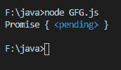
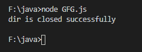

# Node.js fs。目录关闭()方法

> 原文:[https://www.geeksforgeeks.org/node-js-fs-dir-close-method/](https://www.geeksforgeeks.org/node-js-fs-dir-close-method/)

**fs。Dir.close()** 方法是类 **fs 的内置应用编程接口。目录**与**文件系统**模块一起使用，用于异步关闭目录的底层资源句柄。

**语法:**

```js
const dir.close()
```

**参数:**此方法不接受任何参数。
**返回值:**这个方法返回的承诺只是对回调函数 stop()的一个增强。

下面的程序说明了 **fs 的使用。Node.js 中的 Dir.close()** 方法

**例 1:**

**文件名:GFG.js**

## java 描述语言

```js
// Node program to demonstrate the
// dir.close() method
const fs = require('fs');

// Initiating async function
async function stop(path) {

  // Creating and initiating directory's
  // underlying resource handle
  const dir = await fs.promises.opendir(path);

  // Asynchronously closing the directory's
  // underlying resource handle
  const promise = dir.close();

  // Display the result
  console.log(promise);
}

// Catching error
stop('./').catch(console.error);
```

使用以下命令运行 **GFG.js** 文件:

```js
node GFG.js
```

**输出:**



**例 2:**

## java 描述语言

```js
// Node program to demonstrate the
// dir.close() API
const fs = require('fs');

// Initiating async function
async function stop(path) {

  let dir = null;

  try {

  // Creating and initiating directory's
  // underlying resource handle
  dir = await fs.promises.
    opendir(new URL('file:///F:/java/'));

  } finally {

    if (dir) {

      // Display the result
      console.log("dir is closed successfully");

      // Close the file if it is opened.
      await dir.close();
    }
  }
}

// Catching error
stop('./').catch(console.error);
```

使用以下命令运行 **GFG.js** 文件:

```js
node GFG.js
```

**输出:**



**注意:**以上程序不会在在线 JavaScript 和脚本编辑器上运行。
**参考:**[https://nodejs . org/dist/latest-v 12 . x/docs/API/fs . html # fs _ dir _ close](https://nodejs.org/dist/latest-v12.x/docs/api/fs.html#fs_dir_close)