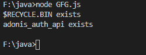
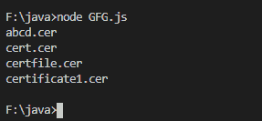

# Node.js fs。目录读取()方法

> 原文:[https://www.geeksforgeeks.org/node-js-fs-dir-read-method/](https://www.geeksforgeeks.org/node-js-fs-dir-read-method/)

**fs。Dir.read()** 方法是类 **fs 的内置应用编程接口。**文件系统**模块内的目录**，用于异步逐个读取下一个目录(目录)。

**语法:**

```
const fs.Dir.read(callback)
```

**参数:**该方法将回调函数作为参数，参数有以下参数。

*   如果出现任何错误，则出现**错误:**。
*   **方向:**读取后目录的方向。

**返回值:**此方法不返回值。

下面的程序说明了 **fs 的使用。Node.js 中的 Dir.read()** 方法:

**示例 1:**
**文件名:GFG.js**

## java 描述语言

```
// Node program to demonstrate the
// dir.path() API
const fs = require('fs');

// Initiating async function
async function stop(path) {

  // Creating and initiating directory's
  // underlying resource handle
  const dir = await fs.promises
    .opendir(new URL('file:///F:/'));

  // Getting all the dirent of the directory
  for (var i = 1 ; i<=2 ; i++) {

    // Reading each dirent one by one
    // by using read() method
    dir.read( (err, dirent) => {

      // Display each dirent one by one
      console.log(`${dirent.name}
      ${err ? 'does not exist' : 'exists'}`);
    });
  }
}

// Catching error
stop('./').catch(console.error);
```

使用以下命令运行 **GFG.js** 文件:

```
node GFG.js
```

**输出:**



**示例 2:**
**文件名:GFG.js**

## java 描述语言

```
// Node program to demonstrate the
// dir.path() API
const fs = require('fs');

// Initiating asyn function
async function stop(path) {

  // Creating and initiating directory's
  // underlying resource handle
  const dir = await fs.promises.opendir(path);

  // Getting all the dirent of the directory
  for (var i = 1 ; i<=4 ; i++) {

    // Reading each dirent one by one
    // by using read() method
    dir.read( (err, dirent) => {

      // Throwing error
      if(err) throw err

      // Display each dirent one by one
      console.log(dirent.name);
    });
  }
}

// Catching error
stop('./').catch(console.error);
```

使用以下命令运行 **GFG.js** 文件:

```
node GFG.js
```

**输出:**



**注意:**以上程序不会在在线 JavaScript 和脚本编辑器上运行。
**参考:**[https://nodejs . org/dist/latest-v 12 . x/docs/API/fs . html # fs _ dir _ read _ callback](https://nodejs.org/dist/latest-v12.x/docs/api/fs.html#fs_dir_read_callback)