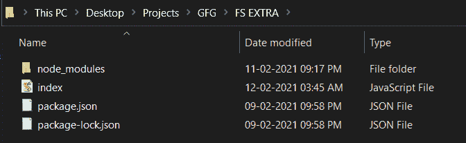
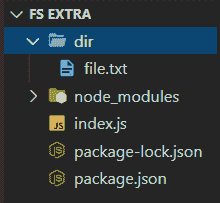

# Node.js fs-extra ensureFile()函数

> 原文:[https://www . geesforgeks . org/node-js-fs-extra-ensurefile-function/](https://www.geeksforgeeks.org/node-js-fs-extra-ensurefile-function/)

**确保文件()**功能确保用户请求的文件存在。如果文件不存在，该函数将创建一个新文件。即使用户请求的文件位于某个目录中，但如果该目录不存在，该函数也会创建该目录以及该目录中的文件。如果文件已经存在，它将不会被修改。 **createFile()** 是 **ensureFile()** 函数的另一个名字，意思是我们可以用 createFile()函数代替 ensureFile()，一切都会按原样工作。

**语法:**

```js
fs.ensureFile(file,callback)
```

或者

```js
fs.createFile(file,callback)
```

**参数:**

*   **文件:**是包含文件路径的字符串。
*   **回调:**由函数完成任务后调用。它要么导致错误，要么导致成功。承诺也可以用来代替回调函数。

**返回值:**不返回任何东西。

**按照步骤实现功能:**

1.  可以使用以下命令安装该模块:

    ```js
    npm install fs-extra
    ```

2.  安装模块后，您可以使用以下命令检查已安装模块的版本:

    ```js
    npm ls fs-extra
    ```

    

3.  使用以下命令创建一个名为 index.js 的文件，并在文件中要求 fs-extra 模块:

    ```js
    const fs = require('fs-extra');
    ```

4.  要运行文件，请在终端中写入以下命令:

    ```js
    node index.js
    ```

**项目结构:**项目结构会是这样的。



**示例 1:** 创建一个名为 file.txt 的文件。我们将在函数中传递这个文件

## index.js

```js
// Requiring module
const fs = require("fs-extra");

// file path
// File already exist
// No modification
// will be done in file
const file = "file.txt";

// Function call
// Using callback function
fs.createFile(file, (err) => {
  if (err) return console.log(e);
  console.log("Successfully completed");
});
```

**输出:**由于我们之前已经创建了文件，该函数不会创建新文件，也不会修改文件中包含的数据。

```js
Successfully completed
```

**示例 2:** 这次我们将传递不存在的文件路径。

## index.js

```js
// Requiring module
const fs = require("fs-extra");

// file path
// Path contains a directory
// which does not exist
// It will create both
// directory and file
const file = "dir/file.txt";

// Function call
// Using Promises
fs.createFile(file)
  .then(() => console.log("Successfully Completed"))
  .catch((err) => console.log(err));
```

**输出:**您将观察到，现在创建了一个名为 dir 的目录，它包含一个名为 file.txt 的文件。

```js
Successfully Completed
```



**参考:**[https://github . com/jprichardson/node-fs-extra/blob/HEAD/docs/ensurefile . MD](https://github.com/jprichardson/node-fs-extra/blob/HEAD/docs/ensureFile.md)