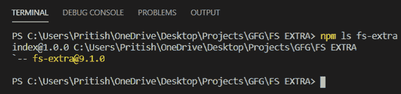
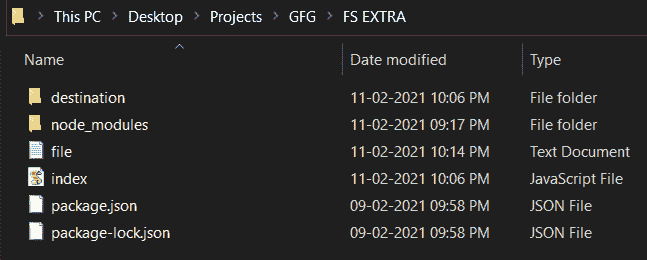
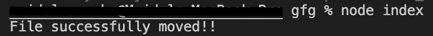
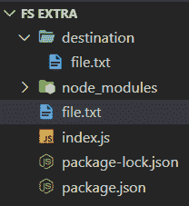
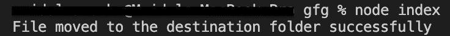
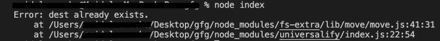

# node . js fs-额外移动()功能

> 原文:[https://www . geesforgeks . org/node-js-fs-extra-move-function/](https://www.geeksforgeeks.org/node-js-fs-extra-move-function/)

**move()** 功能将文件或目录从源移动到用户指定的目标。如果你想将一个文件移动到一个已经存在同名文件的文件夹中，如果我们已经将覆盖选项设置为**真**，该功能将**覆盖**该文件，否则它将抛出一个错误，即文件夹中已经存在一个**文件**。

**语法:**

```
fs.move(src,dest,options,callback);
```

**参数:**该功能接受四个参数，如上所述，如下所述。

*   **src:** 是包含要移动的文件路径(源路径)的字符串。
*   **dest:** 它是一个字符串，包含文件将被移动到的路径(目标路径)。
*   **选项:**是属性**覆盖**的对象，可以是真也可以是假。默认情况下，:false。如果设置为 true，则如果目标文件夹中存在同名文件，该文件将被覆盖。
*   **回调:**是执行 move()函数后会调用的函数。它要么导致错误，要么导致成功。这是一个可选参数，我们也可以用 promises 代替回调函数。

**返回值:**不返回任何东西。

**按照步骤实现功能:**

1.  可以使用以下命令安装该模块:

    ```
    npm install fs-extra
    ```

2.  安装模块后，您可以使用以下命令检查已安装模块的版本:

    ```
    npm ls fs-extra
    ```

    

3.  使用以下命令创建一个名为 index.js 的文件，并在文件中要求 fs-extra 模块:

    ```
    const fs = require('fs-extra');
    ```

4.  创建一个名为 destination 的空文件夹和一个名为 file.txt 的文件。我们将使用此功能将文件移动到目标文件夹中。

5.  要运行文件，请在终端中写入以下命令:

    ```
    node index.js
    ```

项目结构如下所示:



**例 1:**

## index.js

```
// Requiring module
import fs from "fs-extra";

// Source file
const src = "file.txt";

// Destination path
const dest = "destination/file.txt";

// Function call
// Using call back function
fs.move(src, dest, (err) => {
  if (err) return console.log(err);
  console.log(`File successfully moved!!`);
});
```

**输出:**现在检查我们之前创建的目标文件夹。您会发现名为 file.txt 的文件现在被移动到目标文件夹



**例 2:** 我们再举一个例子。在目标文件夹中创建一个文件名为 file.txt 的文件，并在目标文件夹外创建另一个文件名为 file.txt 的文件。在本例中，我们将尝试函数的 overwrite 属性。文件夹结构现在看起来像:



## index.js

```
// Requiring module
import fs from "fs-extra";

// Source file
const src = "file.txt";

// Destination path
const dest = "destination/file.txt";

// Function call
// Using promises
// Setting overwrite to true
fs.move(src, dest, { overwrite: true })
  .then(() => console.log("File moved to the destination"+
                          " folder successfully"))
  .catch((e) => console.log(e));
```

**输出:**您将观察到目标文件夹中的文件现在被文件夹外的文件覆盖。



**注意:**如果没有将**覆盖**属性设置为**假**，上述程序将导致以下错误:



所以这就是我们如何在程序中使用 **move()** 函数。

**参考:**[https://github . com/jprichardson/node-fs-extra/blob/HEAD/docs/move . MD](https://github.com/jprichardson/node-fs-extra/blob/HEAD/docs/move.md)