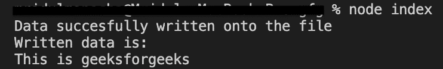
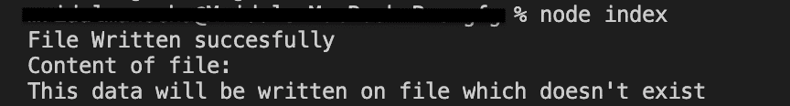

# Node.js fs-extra outputFile()函数

> 原文:[https://www . geesforgeks . org/node-js-fs-extra-output file-function/](https://www.geeksforgeeks.org/node-js-fs-extra-outputfile-function/)

**outputFile()** 函数将数据写入给定文件。它类似于 [writeFile()](https://www.geeksforgeeks.org/node-js-fs-writefile-method/) 函数，只是如果要写入数据的文件不存在，它将由函数本身创建。即使文件位于不存在的目录中，也会由函数本身创建。

**语法:**

```js
fs.outputFile(file,data,options,callback)
```

**参数:**该功能接受四个参数，如上所述，如下所述。

*   **文件:**它是一个字符串，定义了必须写入的文件路径。
*   **数据:**它是将被写入文件的字符串、缓冲区、类型数据或数据视图。
*   **选项:**是用于指定可选参数的字符串或对象。可用选项包括:
*   **回调:**由函数完成任务后调用。它要么导致错误，要么导致成功。承诺也可以用来代替回调函数。

1.  **编码:**是定义文件编码的字符串。默认情况下，该值为 **utf-8** 。

2.  **模式:**定义文件模式的整数值。默认情况下，该值为 **0o666** 。

3.  **标志:**它是一个字符串值，定义写入文件时使用的标志。默认情况下，该值为**。你可以在这里查看旗帜[。](https://nodejs.org/api/fs.html#fs_file_system_flags)**

4.  ****信号:**中止信号允许中止正在进行的输出文件。**

****返回值:**不返回任何东西。**

****按照步骤实现功能:****

1.  **可以使用以下命令安装该模块:**

    ```js
    npm install fs-extra
    ```

2.  **安装模块后，您可以使用以下命令检查已安装模块的版本:**

    ```js
    npm ls fs-extra
    ```

    ****

3.  **使用以下命令创建一个名为 index.js 的文件，并在文件中要求 fs-extra 模块**

    ```js
    const fs = require('fs-extra');
    ```

4.  **要运行文件，请在终端中写入以下命令:**

     **```js
    node index.js
    ```** 

**项目结构如下所示:**

****

****例 1:****

## **index.js**

```js
// Requiring module
import  fs from "fs-extra";

// file already exist
// so data will be written
// onto the file
const file = "file.txt";

// This data will be
// written onto file
const data = "This is geeksforgeeks";

// Function call
// Using callback function
fs.outputFile(file, data, (err) => {
  if (err) return console.log(err);
  console.log("Data successfully written onto the file");
  console.log("Written data is: ");
  //   Reading data after writing on file
  console.log(fs.readFileSync(file, "utf-8"));
});
```

****输出:****

****

****例 2:****

## **index.js**

```js
// Requiring module
import fs from "fs-extra";

// file and directory
//  does not  exist
// so both  will be created
// and data will be written
// onto the file
const file = "dir/file.txt";

// This data will be
// written onto file
const data = "This data will be written on file which doesn't exist";

// Additional options
const options = {
  encoding: "utf-8",
  flag: "w",
  mode: 0o666,
};

// Function call
// Using Promises
fs.outputFile(file, data, options)
  .then(() => {
    console.log("File Written successfully");
    console.log("Content of file: ");
    console.log(fs.readFileSync(file, "utf-8"));
  })
  .catch((e) => console.log(e));
```

****输出:****

****

****参考:**[https://github . com/jprichardson/node-fs-extra/blob/HEAD/docs/output file . MD](https://github.com/jprichardson/node-fs-extra/blob/HEAD/docs/outputFile.md)**