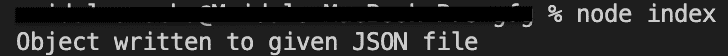
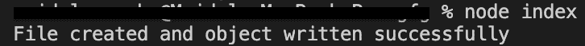

# Node.js fs-extra outputJson()函数

> 原文:[https://www . geesforgeks . org/node-js-fs-extra-outputjson-function/](https://www.geeksforgeeks.org/node-js-fs-extra-outputjson-function/)

**outputJson()** 函数将一个对象写入 Json 文件。如果用户想将数据写入一个不存在的文件，它将由函数自己创建。 **outputJSON()** 也可以代替 outputJSON()。

**语法:**

```js
fs.outputJson(file,object,options,callback)
```

或者

```js
fs.outputJSON(file,object,options,callback)
```

**参数:**

*   **文件:**是包含文件路径的字符串。
*   **对象:**是将要写入文件的对象。
*   **选项:**是一个包含可选参数的对象，可以传递到函数中。

**1。空格:**它是一个指定要缩进的空格数的数字，或者是一个用于缩进的字符串，如制表符的 **'\t'** 。

**2。EOL:** 是行末字符。默认情况下，角色是 **'\n '。**

**3。replacer:** 这可以是用作 stringify 的选定过滤器的函数或数组。如果该值为空，则对象的所有属性都包含在一个字符串中。

**4。**也接受 [fs.writeFile()](https://www.geeksforgeeks.org/node-js-fs-writefile-method/) 选项。

*   **回调:**由函数完成任务后调用。它要么导致错误，要么导致成功。承诺也可以用来代替回调函数。

**返回值:**不返回任何东西。

**按照步骤实现功能:**

1.  可以使用以下命令安装模块:

    ```js
    npm install fs-extra
    ```

2.  安装模块后，您可以使用以下命令检查已安装模块的版本:

    ```js
    npm ls fs-extra
    ```

    

3.  使用以下命令创建一个名为 index.js 的文件，并在文件中要求 fs-extra 模块:

    ```js
    const fs = require('fs-extra');
    ```

4.  要运行文件，请在终端中写入以下命令:

    ```js
    node index.js
    ```

**项目结构:项目结构会是这样的。**


**例 1:**

## index.js

```js
// Requiring module
import fs from "fs-extra"

// This file already
// exists so function
// will write onto the file
const file = "file.json";

// Object
// This will be
// written onto
// the file
const object = {
  name: "GeeksforGeeks",
  type: "website",
};

// Function call
// Using callback function
fs.outputJSON(file, object, err => {
  if(err) return console.log(err);
  console.log("Object written to given JSON file");
});
```

**输出:**



**例 2:**

## index.js

```js
// Requiring module
import fs from "fs-extra"

// This file does not
// exists so function
// will create file
// and write data onto it
const file = "dir/file.json";

// Object
// This will be
// written onto
// the file
const object = {
  name: "GeeksforGeeks",
  type: "website",
};

// Additional options
const options = {
  spaces: 2,
  EOL: "\n",
};

// Function call
// Using Promises
fs.outputJSON(file, object, options)
  .then(() => console.log("File created and object written successfully"))
  .catch((e) => console.log(e));
```

**输出:**



**参考:**[https://github . com/jprichardson/node-fs-extra/blob/HEAD/docs/outputjson . MD](https://github.com/jprichardson/node-fs-extra/blob/HEAD/docs/outputJson.md)