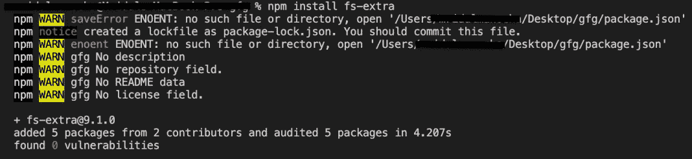
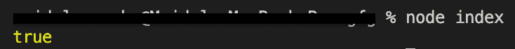
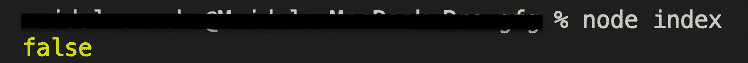

# node . js fs-额外路径存在()函数

> 原文:[https://www . geesforgeks . org/node-js-fs-extra-path exists-function/](https://www.geeksforgeeks.org/node-js-fs-extra-pathexists-function/)

**路径存在()**测试给定的文件路径是否存在。它在引擎盖下使用 [fs.access()](https://www.geeksforgeeks.org/node-js-fs-access-method/) 。

**语法:**

```
fs.pathExists(file,callback)
```

**参数:**该函数接受两个参数，如上所述，如下所述:

*   **文件:**是包含文件路径的字符串。
*   **回调:**函数执行后调用。它将导致一个错误或者一个名为 exists 的布尔值。我们也可以用承诺来代替回调函数。

**返回值:**不返回任何东西。

按照以下步骤实现该功能:

1.  可以使用以下命令安装该模块:

    ```
    npm install fs-extra
    ```

    

2.  安装模块后，您可以使用以下命令检查已安装模块的版本:

    ```
    npm ls fs-extra
    ```

    

3.  使用以下命令创建一个名为 index.js 的文件，并在文件中要求 fs-extra 模块:

    ```
    const fs = require('fs-extra');
    ```

4.  要运行文件，请在终端中写入以下命令:

    ```
    node index.js
    ```

**项目结构:**项目结构会是这样的:


**例 1:**

## index.js

```
// Requiring module
const fs = require("fs-extra");

// This file already
// exists so function
// will return true
const file = "file.txt";

// Function call
// Using callback function
fs.pathExists(file, (err, exists) => {
  if (err) return console.log(err);
  console.log(exists);
});
```

**输出:**这将是控制台输出。



**例 2:**

## index.js

```
// Requiring module
const fs = require("fs-extra");

// This file doesn't
// exists so function
// will return false
const file = "dir/file.txt";

// Function call
// Using Promises
fs.pathExists(file)
  .then((exists) => console.log(exists))
  .catch((e) => console.log(e));
```

**输出:**这将是控制台输出。

