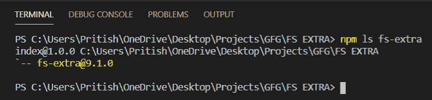
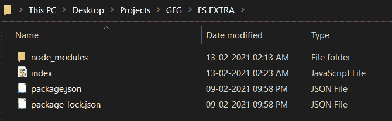

# Node.js fs-extra readJson()函数

> 原文:[https://www . geesforgeks . org/node-js-fs-extra-readjson-function/](https://www.geeksforgeeks.org/node-js-fs-extra-readjson-function/)

**readJson()** 函数读取一个 Json 文件，然后将其解析为一个对象。如果文件不存在，它将抛出一个错误。 **readJSON()** 也可以代替 readJSON()。

**语法:**

```js
fs.readJson(file,options,callback)
```

或者

```js
fs.readJSON(file,options,callback)
```

**参数:**

*   **文件:**是包含文件路径的字符串。
*   **选项:**是可以传入函数的可选参数。选项与 [fs.readFile()](https://www.geeksforgeeks.org/node-js-fs-readfile-method/) 选项相同。
*   **回调:**由函数完成任务后调用。这将导致一个错误，或者文件中存储了 JSON 数据的对象。承诺也可以用来代替回调函数。

**返回值:**不返回任何东西。

**按照步骤实现功能:**

1.  可以使用以下命令安装模块:

    ```js
    npm install fs-extra
    ```

2.  安装模块后，您可以使用以下命令检查已安装模块的版本:

    ```js
    npm ls fs-extra
    ```

    

3.  3.使用以下命令创建一个名为 index.js 的文件，并在文件中要求 fs-extra 模块:

    ```js
    const fs = require('fs-extra');
    ```

4.  要运行文件，请在终端中写入以下命令:

    ```js
    node index.js
    ```

**项目结构:**项目结构会是这样的。



**例 1:**

## index.js

```js
// Requiring module
import fs from "fs-extra"

// File path
const file = "file.json";

// Function call
// Using callback function
fs.readJson(file, (err, object) => {
  if (err) return console.log(err);
  console.log(object);
});
```