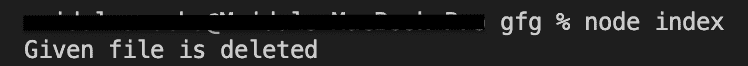
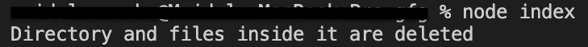

# node . js fs-额外移除()功能

> 原文:[https://www . geesforgeks . org/node-js-fs-extra-remove-function/](https://www.geeksforgeeks.org/node-js-fs-extra-remove-function/)

Yhe **remove()** 函数删除给定的文件或目录。目录中的所有文件都会被删除。如果给定的文件或目录不存在，该函数将什么也不做。

**语法:**

```
fs.remove(path,callback)
```

**参数:**该函数接受两个参数，如上所述，如下所述。

*   **路径:**是包含文件路径或目录路径的字符串。
*   **回调:**函数执行后调用。我们也可以用承诺来代替回调函数。

**返回值:**不返回任何东西。

按照以下步骤实现该功能:

*   可以使用以下命令安装该模块:

    ```
    npm install fs-extra
    ```

*   安装模块后，您可以使用以下命令检查已安装模块的版本:

    ```
    npm ls fs-extra
    ```

    

*   使用以下命令创建一个名为 index.js 的文件，并在文件中要求 fs-extra 模块:

    ```
    const fs = require('fs-extra');
    ```

*   要运行文件，请在终端中写入以下命令:

    ```
    node index.js
    ```

    项目结构如下所示:

    

    **例 1:**

    ## index.js

    ```
    // Requiring module
    import { remove } from "fs-extra";

    // This file exists
    // already so the
    // function will delete it
    const file = "file.txt";

    // Function call
    // Using callback function
    fs.remove(file, (err) => {
      if (err) return console.log(err);
      console.log("Given file is deleted");
    });
    ```

    **输出:**该输出将是控制台输出。

    

    **例 2:**

    ## index.js

    ```
    // Requiring module
    import { remove } from "fs-extra";

    // The directory and
    // the files inside 
    // it will be deleted
    const file = "dir";

    // Function call
    // Using Promises
    remove(file)
      .then(() => console.log("Directory and files inside it are deleted"))
      .catch((e) => console.log(e));
    ```

    **输出:**该输出将是控制台输出。

    

    **参考:**[https://github . com/jprichardson/node-fs-extra/blob/HEAD/docs/remove . MD](https://github.com/jprichardson/node-fs-extra/blob/HEAD/docs/remove.md)