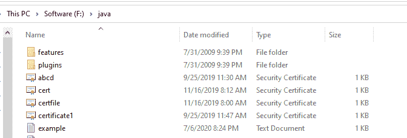

# Node.js fs.filehandle.chown()方法

> 原文:[https://www . geesforgeks . org/node-js-fs-file handle-chown-method/](https://www.geeksforgeeks.org/node-js-fs-filehandle-chown-method/)

**fs.filehandle.chown()** 方法是**文件系统**模块中类 **fs.filehandle** 的内置应用编程接口，用于更改特定文件的所有权。

**语法:**

```js
const filehandle.chown(uid, gid)
```

**参数:**该方法接受两个参数，如上所述，如下所述:

*   **uid:** :代表用户 id。
*   **gid:** 表示组标识符。

**返回值:**该方法返回一个不包含任何值的待定承诺。

下面的程序说明了 **fs.filehandle.chown()** 方法的使用。
**示例 1:** **文件名:index.js**

## java 描述语言

```js
// Node.js program to demonstrate the
// filehandle.chown() method
const fs = require('fs');
const fsPromises = fs.promises;

console.log("content of file before operation :- "
        + (fs.readFileSync('example.txt')));

// Initiating asyncrionise function
async function funct() {

    // Initializing filehandle
    let filehandle = null;

    try {

        // Creating and initiating filehandle
        filehandle = await
            fsPromises.open('example.txt', 'r+');

        // Modifying the file ownership
        // by using chown() method
        const prom = filehandle.chown(1, 1);

    } finally {

        if (filehandle) {

            // Close the file if it is opened.
            console.log("ownership is changed"
                        + " successfully");

            console.log("content of file after"
                + " operation :- " +
                (fs.readFileSync('example.txt')));

            await filehandle.close();
        }
    }
}

funct().catch(console.error);
```

运行程序前的目录结构:



运行程序后的目录结构:


使用以下命令运行 **index.js** 文件:

```js
node index.js
```

**输出:**

```js
content of file before operation :- Content of example.txt file
ownership is changed successfully
content of file after operation :- Content of example.txt file
```

**示例 2:** **文件名:index.js**

## java 描述语言

```js
// Node.js program to demonstrate the
// filehandle.chown() method
const fs = require('fs');
const fsPromises = fs.promises;

// Data for the new file
let data = "This is a file containing "
        + "a collection of books.";

// Name of the file to be created
let file = "books.txt";

// Creating the new file 'books.txt'
fs.writeFile(file, data, (err) => {

    // Cathing error
    if (err) {
        console.log(err);
    }
});

// Using fs.exists() method
fs.exists(file, (exists) => {
    if (exists) {
        console.log("content of file"
            + " before operation :- " +
            (fs.readFileSync(file)));
    }
});

// Initiating asyncrionise function
async function funct() {

    // Initializing filehandle
    let filehandle = null;

    try {

        // Creating and initiating
        // filehandle
        filehandle = await
            fsPromises.open(file, 'r+');

        // Modifying the file ownership
        // by using chown() method
        const prom = filehandle.chown(1, 1);

    } finally {

        if (filehandle) {

            // Close the file if it is opened.
            console.log("ownership is changed");

            console.log("content of file "
                + "after operation :- " +
                (fs.readFileSync(file)));

            await filehandle.close();
        }
    }
}

funct().catch(console.error);
```

运行程序前的目录结构:


运行程序后的目录结构:


使用以下命令运行 **index.js** 文件:

```js
node index.js
```

**输出:**

```js
content of file before operation :- This is a file containing a collection of books.
ownership is changed
content of file after operation :- This is a file containing a collection of books.
```

**参考:**
[https://nodejs . org/dist/latest-v 12 . x/docs/API/fs . html # fs _ file handle _ chown _ uid _ GID](https://nodejs.org/dist/latest-v12.x/docs/api/fs.html#fs_filehandle_chown_uid_gid)