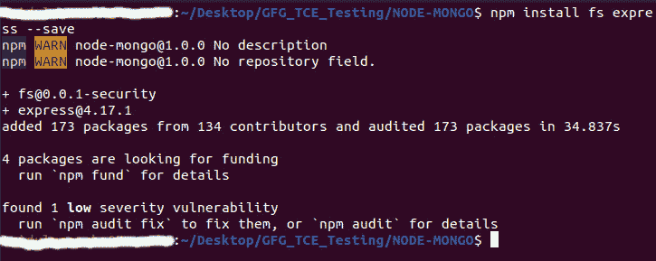

# Node.js fs.fsyncSync()方法

> 原文:[https://www.geeksforgeeks.org/node-js-fs-fsyncsync-method/](https://www.geeksforgeeks.org/node-js-fs-fsyncsync-method/)

在本文中，我们将在**节点中学习 **fsyncSync()** 方法。在深入话题之前，我们先简单了解一下 [**fsync**](https://www.geeksforgeeks.org/node-js-fs-fsync-method/) **()** 方法是什么。**

Node.js 为我们提供了一个***【fs】模块*** ，可以帮助我们实现同步和异步两种形式。异步表单的最后一个参数是回调，而在同步表单中，它只包含**文件** **描述符**。一个 **fsync()** 函数不返回值，但是有助于同步获取文件描述符。一个 **fsyncSync()** 方法正好是 **fsync()** 的同步形式。有助于**同步****磁盘缓存**。

**语法:**

```
fs.fsyncSync(fd)
```

**fd** 指的是**文件描述符**，其返回值为**未定义**。

**参数:**文件描述符。

**返回类型:**未定义。

文件描述符是唯一标识计算机中打开文件的数字。它为全局文件表提供了一个条目，为我们提供了该条目的位置。例如:如果文件描述符为 3，则表示在全局文件表中保存为**读/写操作**，且**偏移量:12** 。

首先我们需要在我们的 **NodeJS** 项目中安装**【fs】****【快递】**模块。

```
npm install fs express --save
```



在 node.js 项目中创建一个文件**‘example . txt’**，这样我们就可以对该文件使用任何类型的操作。之后，为我们的项目编写必要的 javascript 代码。

example.txt