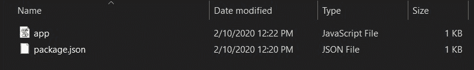
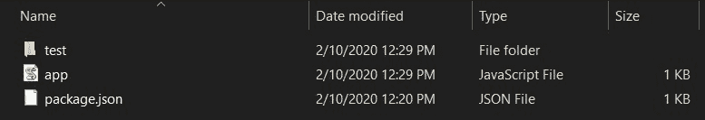

# Node.js fs.mkdir()方法

> 原文:[https://www.geeksforgeeks.org/node-js-fs-mkdir-method/](https://www.geeksforgeeks.org/node-js-fs-mkdir-method/)

**fs.mkdir()方法** i Node.js 用于异步创建目录。

**语法**

```
fs.mkdir(path, mode, callback)
```

**参数:**该方法接受三个参数，如上所述，如下所述:

*   **路径:**该参数保存需要创建的目录的路径。
*   **模式:**该参数保存递归布尔值。模式选项用于设置目录权限，默认为 0777。
*   **回调:**此参数保存包含错误的回调函数。如果要创建的目录已经存在，递归选项如果设置为 true 将不会给出错误消息。

下面的例子说明了 **fs.mkdir()方法**在 Node.js 中的使用:

**例 1:**

```
// Node.js program to demonstrate the   
// fs.mkdir() Method

// Include fs and path module
const fs = require('fs');
const path = require('path');

fs.mkdir(path.join(__dirname, 'test'), (err) => {
    if (err) {
        return console.error(err);
    }
    console.log('Directory created successfully!');
});
```

**输出:**

```
Directory created successfully!
```

*   **运行代码前的目录结构:**
    
*   **目录结构运行代码后:**
    

**注意:**如果你再次运行这个程序，那么它会显示一条错误消息，因为目录已经存在。为了克服这个错误，我们将使用递归选项。

**示例 2:** 该示例说明了如何使用递归选项。

```
// Node.js program to demonstrate the   
// fs.mkdir() Method

// Include fs and path module
const fs = require('fs');
const path = require('path');

fs.mkdir(path.join(__dirname, 'test'),
  { recursive: true }, (err) => {
    if (err) {
      return console.error(err);
    }
    console.log('Directory created successfully!');
  });
```

**输出:**

```
Directory created successfully!
```

**参考:**https://nodejs . org/API/fs . html # fs _ fs _ mkdir _ path _ options _ callback