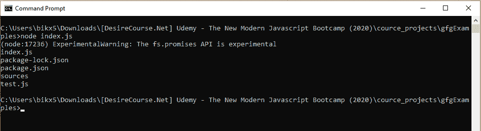

# Node.js fs.promise.readdir()方法

> 原文:[https://www . geesforgeks . org/node-js-fs-promise-readdir-method/](https://www.geeksforgeeks.org/node-js-fs-promise-readdir-method/)

Node.js 的文件系统模块中定义的 **fs.promise.readdir()** 方法，文件系统模块基本上是与用户电脑的硬盘进行交互。readdir()方法用于读取文件和文件夹名称。fs.promise.readdir()方法返回一个已解决或被拒绝的承诺，因此避免了在 **fs.readdir()** 方法中可能出现的回调嵌套或回调地狱问题。

**语法**

```
fs.promise.readdir(path, options)
```

**参数:**该方法接受两个参数，如上所述，如下所述:

*   **路径:**它是一个字符串、缓冲区或 url，指定要读取其内容的目录的路径。
*   **选项:**为可选参数，用于指定编码技术(默认-utf8)等。

**返回值:**返回已解决或已拒绝的承诺。如果成功读取目录，则用文件和文件夹的名称列表来解析承诺；否则，如果发生任何错误，则用错误对象来拒绝承诺(例如，指定的目录不存在或没有读取文件的权限等)。

**例 1:**

```
// Node.js program to demonstrate the   
// fs.promise.readdir() Method 

// Importing File System module
const fs = require('fs')

// The process.cwd() gives current
// working directory
fs.promises.readdir(process.cwd())

    // If promise resolved and
    // datas are fetched
    .then(filenames => {
        for (let filename of filenames) {
            console.log(filename)
        }
    })

    // If promise is rejected
    .catch(err => {
        console.log(err)
    })
```

**输出:**读取并显示当前工作目录
的内容

**例 2:**

```
// Node.js program to demonstrate the   
// fs.promise.readdir() Method 

// Importing File System module
const fs = require('fs')

// process.cwd() gives current
// working directory
const targetDir = process.argv[2] || process.cwd()

fs.promises.readdir(targetDir)

    // If promise resolved and 
    // datas are fetched
    .then(filenames => {
        for (let filename of filenames) {
            console.log(filename)
        }
    })

    // If promise is rejected
    .catch(err => {
        console.log(err)
    })
```

**输出:**读取并显示一个目录的内容回到当前工作目录‘gfgExamples’。
T3】

**参考:**[https://nodejs . org/docs/latest/API/fs . html # fs _ fspromises _ readdir _ path _ options](https://nodejs.org/docs/latest/api/fs.html#fs_fspromises_readdir_path_options)