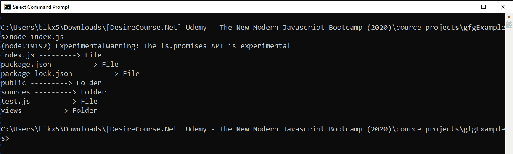

# Node.js fsPromise.lstat()方法

> 原文:[https://www . geesforgeks . org/node-js-fspromise-lstat-method/](https://www.geeksforgeeks.org/node-js-fspromise-lstat-method/)

**fs.promise.lstat()** 方法是在 Node.js 的文件系统模块中定义的，文件系统模块基本上就是和用户电脑的硬盘进行交互。lstat()方法使用 stats 对象上定义的方法(lstat 提供的数据)给出文件和文件夹的特定信息。fs.promise.lstat()方法返回已解决或已拒绝的承诺，因此避免了 fs.readdir()方法中可能出现的回调嵌套或回调地狱问题。
**语法**

```js
fs.promise.lstat(path, options)
```

**参数:**该方法接受两个参数，如上所述，如下所述:
**路径:**它是一个字符串、缓冲区或 url，指定目录的路径，我们尝试读取目录的内容。
**选项:**是可选参数。一个选项参数是“bigint”，它是一个布尔值。这里，我们指定 fs.lstat()方法返回的 stats 对象中的数值是否为 bigint(默认值-false)。
**返回值:**返回已解决或已拒绝的承诺。如果成功读取目录，则使用 stats 对象解析承诺；否则，如果出现任何错误，则使用 error 对象拒绝承诺(例如，指定的目录不存在或没有读取文件的权限等)。
从解析的承诺返回的 stats 对象中定义了一些属性和方法，这有助于获得一些关于目标文件或文件夹的具体细节。下面列出了一些方法。

*   **stats.isDirectory():** 如果 stats 对象描述文件系统目录，则返回 true。
*   **stats.isFile():** 如果 stats 对象描述了一个常规文件，则返回 true。
*   **stats.isSocket():** 如果 stats 对象描述了一个套接字，则返回 true。
*   **stats . issymbolilink():**如果 stats 对象描述了符号链接，则返回 true。
*   **stats.isFile():** 如果 stats 对象描述了一个常规文件，则返回 true。
*   **stats.isFIFO():** 如果 stats 对象描述了先进先出管道，则返回 true。
*   **stats.size:** 以字节为单位指定文件的大小。
*   **stats.blocks:** 指定为文件分配的块数。

**例 1:**

## java 描述语言

```js
// Node.js program to demonstrate the   
// Buffer.from() Method 

// Importing File System module
const fs = require('fs')

// fs.readdir() reads contents of 
// target directory 
// process.cwd() gives current 
// working directory
fs.readdir(process.cwd(), (err, filenames) => {
  if (err) {
    console.log(err)
    return
  }

  for (let filename of filenames) {

    // Calling lstat method to give the 
    // stats object for every directory
    fs.promises.lstat(filename)

      // If promise resolved and datas
      // are fetched
      .then(stats => {
        if (stats.isFile()) {
          console.log(`${filename} ---------> File`)
        } else {
          console.log(`${filename} ---------> Folder`)
        }
      })

      // If promise is rejected
      .catch(err => {
        console.log(err)
      })
  }
})
```

**输出:**



**例 2:**

## java 描述语言

```js
// Node.js program to demonstrate the   
// Buffer.from() Method 

// Importing File System module
const fs = require('fs')

// The fs.readdir() method reads the 
// contents of target directory
// The process.cwd() method gives the
// current working directory
fs.readdir(process.cwd(), async (err, filenames) => {
  if (err) {
    console.log(err)
    return
  }
  for (let filename of filenames) {

    // Calling lstat method to give the
    // stats object for every directory
    fs.promises.lstat(filename)

      // If promise resolved and datas
      // are fetched
      .then(stats => {
        console.log(
          `${filename} --------> ${stats.size} bytes`)
      })

      // If promise is rejected
      .catch(err => {
        console.log(err)
      })
  }
})
```

**输出:**


**参考:**[https://nodejs . org/API/fs . html # fs _ fspromises _ lsat _ path _ options](https://nodejs.org/api/fs.html#fs_fspromises_lstat_path_options)