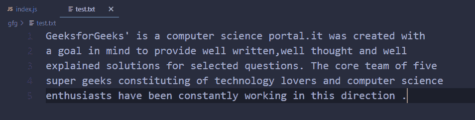
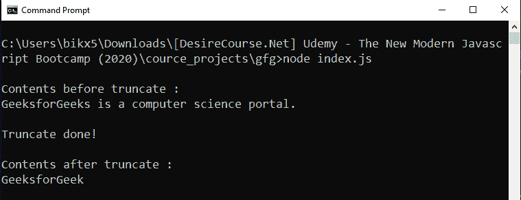

# Node.js fsPromises.truncate()方法

> 原文:[https://www . geesforgeks . org/node-js-fspromiss-truncate-method-2/](https://www.geeksforgeeks.org/node-js-fspromises-truncate-method-2/)

**fsPromises.truncate()** 方法是在 Node.js 的文件系统模块中定义的，文件系统模块基本上是用来和用户电脑的硬盘进行交互的。

**truncate()** 方法用于通过‘len’字节修改文件的内部内容。如果 len 小于文件的当前长度，文件将被截断为 len 的长度，如果 len 大于文件长度，则通过附加空字节(x00)来填充文件，直到达到 len。

**语法:**

```
fs.promises.truncate(path, len)
```

**参数:**该方法接受两个参数，如上所述，如下所述:

*   **路径:**它是一个字符串、缓冲区或 Url，用于指定目标文件的路径。
*   **len:** 是一个数字值，指定文件的长度，在该长度之后文件将被截断。这是一个可选参数，默认值为 0，即如果不提供 len 参数，将截断整个文件。

**返回值:**该方法返回一个承诺，该承诺将在成功时被无参数解析，或者在出错时被错误对象拒绝(前给定路径是指向目录的路径，或者给定路径不存在)。

**例 1:**

```
// Node.js program to demonstrate the   
// fsPromises.truncate() Method

// Importing File System module
const fs = require('fs');

// Truncate operation
fs.promises.truncate('./test.txt')

    // If file is successfully truncated
    .then(() => {
        console.log('File contents are deleted!');
    })

    // If any error occurs
    .catch(err => {
        console.log(`Error Occurs, Error code -> 
    ${err.code}, Error NO -> ${err.errno}`)
    });
```

使用异步等待实现相同的功能。

```
// Node.js program to demonstrate the   
// fsPromises.truncate() Method

// Importing File System module
const fs = require('fs');

const truncate = async (path) => {

    // Truncate operation
    await fs.promises.truncate(path);
    console.log('File contents are deleted!');
}

truncate('./test.txt')

    // If any error occurs
    .catch(err => {
        console.log(`Error Occurs, Error code -> 
        ${err.code}, Error NO -> ${err.errno}`)
    });
```

**运行程序前的文件内容:**


**运行程序后文件内容:**


**输出:**

```
File contents are deleted!
```

**例 2:** 部分截断

```
// Node.js program to demonstrate the   
// fsPromises.truncate() Method

// Importing File System module
const fs = require('fs')

// Fetching contents before truncate 
fs.promises.readFile('./test.txt')
    .then(buff => {
        const oldContents = buff.toString()
        console.log(`\nContents before 
            truncate : \n${oldContents}`)

        // Truncate operation
        return fs.promises.truncate('./test.txt', 12)
    })

    // If file is successfully truncated
    .then(() => {
        console.log('\nTruncate done!\n')

        // Fetching contents after truncate 
        return fs.promises.readFile('./test.txt')
    })

    .then(buff => {
        const newContents = buff.toString()
        console.log(`Contents after 
            truncate : \n${newContents}`)
    })

    // If any error occurs
    .catch(err => {
        console.log(`Error Occurs, Error code -> 
        ${err.code}, Error NO -> ${err.errno}`)
    });
```

使用异步等待实现相同的功能

```
// Node.js program to demonstrate the   
// fsPromises.truncate() Method

// Importing File System module
const fs = require('fs')

// Function to read file contents
const readFileContents = async (path) => {
    const buff = await fs.promises.readFile(path)
    return buff.toString()
}

// Function to truncate
const truncate = async (path, len) => {

    // Fetching contents before truncate 
    const oldContents = 
        await readFileContents('./test.txt')

    console.log(`\nContents before 
            truncate : \n${oldContents}`)

    // Truncate operation
    const buff = await fs.promises.truncate(path, len)
    console.log('\nTruncate done!\n')

    // Fetching contents before truncate 
    const newContents = 
        await readFileContents('./test.txt')

    console.log(`Contents after 
        truncate : \n${newContents}`)
}

truncate('./test.txt', 12)

    // If any error occurs
    .catch(err => {
        console.log(`Error Occurs, Error code -> 
        ${err.code}, Error NO -> ${err.errno}`)
    })
```

**运行程序前的文件内容:**


**运行程序后文件内容:**


**输出:**


**参考:**[https://nodejs . org/dist/latest-v 14 . x/docs/API/fs . html # fs _ fspromises _ truncate _ path _ len](https://nodejs.org/dist/latest-v14.x/docs/api/fs.html#fs_fspromises_truncate_path_len)