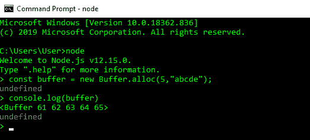
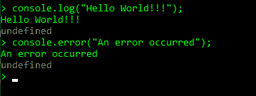
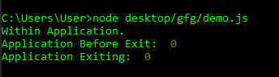
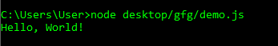
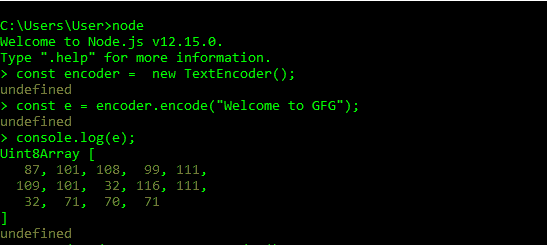
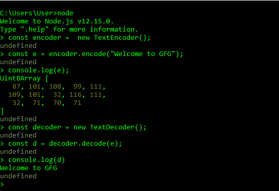
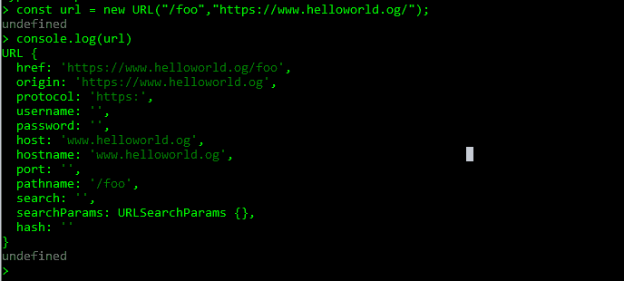
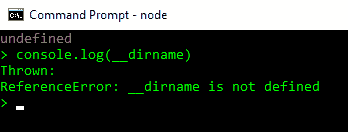
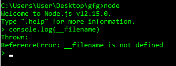

# 节点. js 全局对象

> 原文:[https://www.geeksforgeeks.org/node-js-global-objects/](https://www.geeksforgeeks.org/node-js-global-objects/)

Node.js 是一个开源项目，可以用于服务器端脚本。全局对象是所有模块中可用的对象。全局对象是 JavaScript 的内置对象，可以直接在应用程序中使用，而无需导入任何特定模块。节点. js 全局对象如下所示:

**1。类:Buffer**Buffer 类是一个内置的全局可访问类，这意味着它可以在不导入任何模块的情况下使用。Buffer 类用于处理二进制数据。缓冲类对象用于将二进制数据表示为字节序列。



*   **控制台:**它是一个内置的全局对象，用于打印到 stdout 和 stderr。



*   **进程:**它是一个内置的全局对象，是 EventEmitter 的一个实例，用于获取当前进程的信息。也可以使用 require()显式访问它。



*   **全局:**是全局命名空间。在这个命名空间中定义一个变量使得它可以全局访问。

```js
var myvar
```

**2** 。当在浏览器中声明时，它是一个全局范围。但是，node.js 文件中定义的任何变量只能在该文件中访问。

*   **setImmediate()方法:**它调度回调的立即执行。回调函数按照创建的顺序排队和执行。回调队列在每次事件循环迭代时都会被处理。如果在正在执行的回调中有一个定时器在排队，那么在下一次事件循环迭代之前，定时器不会被触发。
*   **clearImmediate()方法:**它停止 setImmediate()方法返回的即时对象。
*   **setInterval()方法:**它以重复的间隔执行回调函数。如果间隔大于 2147483647 或小于 1，则间隔设置为 1。非整数延迟被截断为最接近的整数。
*   **clearInterval()方法:**停止 setInterval()方法创建的区间对象。

*   **setTimeout()方法:**是一个全局函数，用于在至少延迟毫秒后运行回调函数。Node.js 不保证回调何时触发的确切时间，但会尝试将时间保持在尽可能接近指定的延迟。任何大于 2147483647 或小于 1 的延迟都会自动设置为 1。非整数延迟被截断为最接近的整数。

```js
function printHello() {
   console.log( "Hello, World!");
}

// Now call above function after 2 seconds
var timeoutObj = setTimeout(printHello, 2000);
```



*   **clearTimeout()方法:**cleartime out()方法用于取消或停止用 setTimeout()方法设置的超时。timeoutObj 是 setTimeout()方法返回的对象。

*   **queueMicrotask()方法:**microtask 是一个短函数，在回调函数退出后执行，并且只在 JavaScript 执行堆栈为空时执行。queueMicrotask()方法用于在回调函数成功完成后执行此类函数。如果回调函数没有将控件返回给其他 JavaScript 代码，事件循环将运行微任务队列中的所有微任务。事件循环的每次迭代都会多次处理 microtask 队列。如果一个微任务向队列中添加了更多的微任务，那么新添加的微任务将在下一个任务运行之前执行。这是因为事件循环不断调用微任务，直到队列中没有剩余的微任务。
*   **TextEncoder:** 是 WHATWG 编码标准 TextEncoder API 的实现。TextEncoder 的所有实例都只用 UTF 8 编码。



**3。文本解码器:**它是 WHATWG 编码标准文本解码器 API 的一个实现。



**4。类:URL**URL 类实例是一个全局对象，由下面的 WHATWG URL 标准实现。网址构造函数创建一个新的网址对象，如下所示。/foo 是输入，*https://www.helloworld.og/*是基础值。



**5。URL search params:**URL search params API 用于对 URL 的查询执行读写操作。

```js
const myURL = new URL('https://www.register.com/?name=gfg');

// It prints gfg
console.log(myURL.searchParams.get('name'));

myURL.searchParams.append('name', 'xyz');

// It prints https://www.register.com/?name=gfg&name=xyz
console.log(myURL.href);
```

**6。WebAssembly:** 作为所有 W3C WebAssembly 相关功能的命名空间的全局对象。网络汇编是一种低级的类似汇编的语言，可以在现代浏览器上运行。

以下变量可能看起来是全局的，但实际上只存在于某些模块的范围内。

*   **require(id)方法:**用于导入模块并返回“any”数据类型的对象。

```js
var express = require('express')
```

*   **导出:**用于使用 module.exports 导出模块。
*   **模块:**它是对当前模块的引用，不是全局的，而是每个模块的局部的。它用于通过应用程序中的 require()使特定模块可用。

*   **__dirname:** 输出抛出一个错误，证明 __dirname 不是 node.js 中全局定义的，需要脚本给出想要的输出，因为 __dirname 只在脚本中定义。



*   创建一个演示. js 文件
*   粘贴以下代码:

```js
console.log("__dirname : "+ __dirname);
```

*   运行 demo.js 文件

**7。__filename:** 输出抛出一个错误，证明 __filename 不是在 node.js 中全局定义的，它需要一个脚本给出想要的输出，因为 __filename 只在脚本中定义。



*   创建一个演示. js 文件
*   粘贴以下代码:

```js
console.log("__filename : "+ __filename);
```

*   运行 demo.js 文件