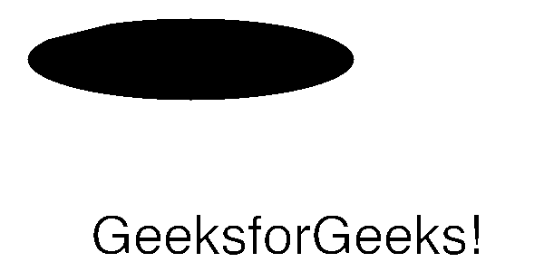

# Node.js GM drawArc()函数

> 原文:[https://www.geeksforgeeks.org/node-js-gm-drawarc-function/](https://www.geeksforgeeks.org/node-js-gm-drawarc-function/)

**绘制圆弧()函数**是 GraphicsMagick 库中的一个内置函数，用于绘制具有指定坐标的圆弧。该函数在成功时返回真值。

**语法:**

```
drawArc( x0, y0, x1, y1, r0, r1 )
```

**参数:**该函数接受六个参数，如上所述，如下所述:。

*   **x0:** 该参数存储初始点的 x 坐标值。
*   **y0:** 该参数存储初始点的 y 坐标值。
*   **x1:** 该参数存储最终点的 x 坐标值。
*   **y1:** 该参数存储最终点的 y 坐标值。
*   **r0:** 该参数取旋转起始角度的值，单位为度。
*   **r1:** 该参数取旋转结束角度的值，单位为度。

**返回值:**该函数返回 GraphicsMagick 对象。

**原图:**


**例 1:**

```
// Include gm library
var gm = require('gm').subClass({imageMagick: true});

// Import the image
gm('1.png')

// set the color for the stroke
.stroke("#ffffff")

// Invoke drawArc function with x0, y0, x1, y1, r0, r1
.drawArc(30, 20, 390, 70, 140, 110)

// Process and write the image 
.write("drawArc1.png", function (err) {
  if (!err) console.log('done');
});
```

**输出:**


**例 2:**

```
// Include gm library
var gm = require('gm');

// Import the image
gm(600, 300, 'white')

// set the color for the stroke
//.stroke("green", 3)

// Set the font 
.font("Helvetica.ttf", 60)

// Invoke drawArc function with x0, y0, x1, y1, r0, r1
.drawArc(30, 20, 390, 110, 240, 210)

// Call to drawText Function
.drawText(100, 280, "GeeksforGeeks!")

// Process and write the image 
.write("drawArc1.png", function (err) {
  if (!err) console.log('done');
});
```

**输出:**


**参考:**

*   [http://www . graphicsmagick . org/graphicsmagick . html # details-trim](http://www.graphicsmagick.org/GraphicsMagick.html#details-trim)
*   [https://www.npmjs.com/package/gm](https://www.npmjs.com/package/gm)