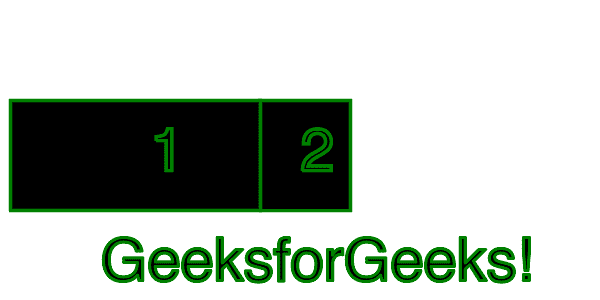

# Node.js GM drawRectangle()函数

> 原文:[https://www . geesforgeks . org/node-js-GM-draw rectangle-function/](https://www.geeksforgeeks.org/node-js-gm-drawrectangle-function/)

**绘制矩形()函数**是 GraphicsMagick 库中的一个内置函数，用于绘制具有指定坐标的矩形。该函数在成功时返回真值。
**语法:**

```js
drawRectangle( x0, y0, x1, y1, wc, hc )
```

**参数:**该函数接受六个参数，如上所述，如下所述:

*   **x0:** 保存矩形的第一个 x 坐标。
*   **y0:** 保存矩形的第一个 y 坐标。
*   **x1:** 保存矩形的第二个 x 坐标。
*   **y1:** 它保存矩形的第二个 y 坐标。
*   **wc:** 是保持宽度圆度的可选参数。
*   **hc:** 是保持高度圆度的可选参数。

**返回值:**该函数返回 GraphicsMagick 对象。
**例 1:无可选参数**

## java 描述语言

```js
// Include gm library
var gm = require('gm');

//Import the image
gm(600, 300, 'white')

// set the color for the stroke
.stroke("green", 3)

// Set the font 
.font("Helvetica.ttf", 60)

// Invoke drawRectangle function with
// x0: 10, y0: 100, x1:260, y1:210
.drawRectangle(10, 100, 260, 210)

// Invoke drawText in order to
// name the box as 1 
.drawText(150, 170, "1")

// Invoke drawrectangle function with
// x0: 260, y0:100, x1: 350, y1: 210
.drawRectangle(260, 100, 350, 210)

// Invoke drawText in order to
// name the box as 2
.drawText(300, 170, "2")

// Call to drawText Function
.drawText(100, 280, "GeeksforGeeks!")

// Process and write the image 
.write("drawRectangle1.png", function (err) {
  if (!err) console.log('done');
});
```

**输出:**



**示例 2:使用可选参数**

## java 描述语言

```js
// Include gm library
var gm = require('gm');

// Import the image
gm(600, 300, 'white')

// set the color for the stroke
.stroke("green", 3)

// Set the font 
.font("Helvetica.ttf", 60)

// Invoke drawRectangle function with
// x0: 10, y0: 100, x1:260, y1:210,
// wc: 40, wh: 40
.drawRectangle(10, 100, 260, 210, 40, 40)

// Invoke drawText in order to name
// the box as 1 
.drawText(150, 170, "1")

// Invoke drawrectangle function with
// x0: 260, y0:100, x1: 350, y1: 210,
// wc: 80, wh: 80
.drawRectangle(260, 100, 350, 210, 80, 80)

// Invoke drawText in order to
// name the box as 2
.drawText(300, 170, "2")

// Call to drawText Function
.drawText(100, 280, "GeeksforGeeks!")

// Process and write the image 
.write("drawRectangle1.png", function (err) {
  if (!err) console.log('done');
});
```

**输出:**


**参考:**

*   [http://www . graphicsmagick . org/graphicsmagick . html #详情-绘制](http://www.graphicsmagick.org/GraphicsMagick.html#details-draw)
*   [https://www.npmjs.com/package/gm](https://www.npmjs.com/package/gm)