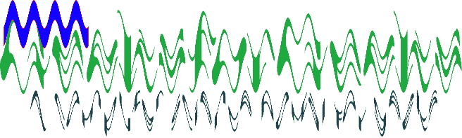

# Node.js GM trim()函数

> 原文:[https://www.geeksforgeeks.org/node-js-gm-trim-function/](https://www.geeksforgeeks.org/node-js-gm-trim-function/)

**修剪()功能**是 GraphicsMagick 库中的一个内置功能，用于移除与角像素颜色完全相同的边缘。该函数在成功时返回真值。

**语法:**

```js
trim()
```

**参数:**此功能不接受任何参数。

**返回值:**该函数返回添加了修剪图像的 GraphicsMagick 对象。

**原图:**


**例 1:**

```js
// Include gm library
var gm = require('gm');

// Import the image
gm('1.png')

// Invoke trim function 
.trim()

// Process and Write the image
.write("trim1.png", function (err) {
    if (!err) console.log('done');
});
```

**输出:**


**例 2:**

```js
// Include gm library
var gm = require('gm');

// Import the image
gm('1.png')

// Set stroke color
.stroke("#fe1232")

// Set fill color
.fill("#1200ff")

// Draw Rectangle using drawRectangle function
.drawRectangle(10, 2, 130, 30, 1, 2)

// Invoke wave function with an amplitude
// as 8 and wavelength as 3
.wave(20, 30)

 // Invoke trim function 
.trim()

// Process and Write the image
.write("trim2.png", function (err) {
  if (!err) console.log('done');
});
```

**输出:**


**参考:**

*   [http://www . graphicsmagick . org/graphicsmagick . html # details-trim](http://www.graphicsmagick.org/GraphicsMagick.html#details-trim)
*   [https://www.npmjs.com/package/gm](https://www.npmjs.com/package/gm)