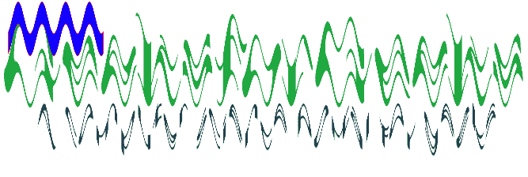

# Node.js GM wave()函数

> 原文:[https://www.geeksforgeeks.org/node-js-gm-wave-function/](https://www.geeksforgeeks.org/node-js-gm-wave-function/)

**wave()函数**是 GraphicsMagick 库中的一个内置函数，用于随着正弦波改变图像。该函数在成功时返回真值。

**语法:**

```js
wave( amplitude, wavelength )
```

**参数:**该函数接受两个参数，如上所述，如下所述:

*   **振幅:**该参数存储正弦波的振幅值。
*   **波长:**该参数存储正弦波的波长值。

**返回值:**该函数返回添加了图像的 GraphicsMagick 对象。

**原图:**


**例 1:**

```js
// Include gm library
var gm = require('gm');

// Import the image
gm('gfg.png')

// Invoke wave function with an amplitude
// values as 10 and wavelength as 3
.wave(10, 3)

// Process and Write the image
.write("wave1.png", function (err) {
  if (!err) console.log('done');
});
```

**输出:**


**例 2:**

```js
// Include gm library
var gm = require('gm');

// Import the image
gm('gfg.png')

// Set stroke color
.stroke("#fe1232")

// Set fill color
.fill("#1200ff")

// Draw Rectangle using drawRectangle function
.drawRectangle(10, 2, 130, 30, 1, 2)

// Invoke wave function with an amplitude
// as 20 and wavelength as 30
.wave(20, 30)

// Process and Write the image
.write("wave2.png", function (err) {
    if (!err) console.log('done');
});
```

**输出:**


**参考:**

*   [http://www . graphicsmagick . org/graphicsmagick . html #详情-wave](http://www.graphicsmagick.org/GraphicsMagick.html#details-wave)
*   [https://www.npmjs.com/package/gm](https://www.npmjs.com/package/gm)