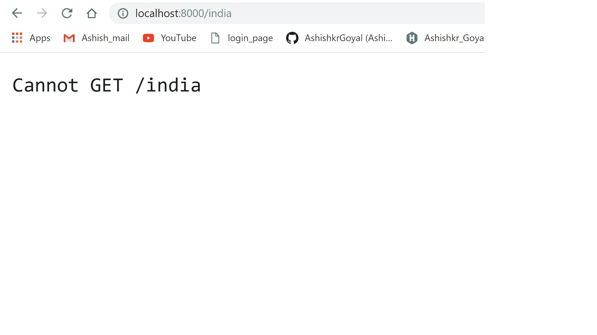
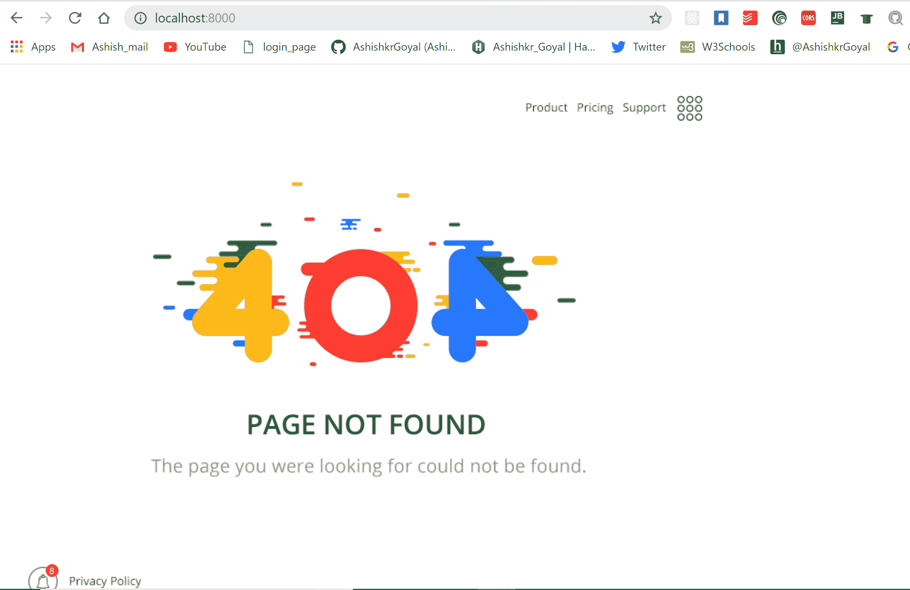

# 节点. js 处理无效路由

> 原文:[https://www . geesforgeks . org/node-js-handling-invalid-routes/](https://www.geeksforgeeks.org/node-js-handling-invalid-routes/)

在开发 Node 时。Js 应用程序处理无效路由很重要。
可以通过编写自定义路由或将所有无效路由重定向到任意自定义页面来实现。

**Let’s develop an simple nodejs server for handling invalid routes:**

*   **步骤 1:创建项目文件夹**
    为无效路线项目创建单独的文件夹。*   **第二步:创建 package.json**
    将在终端或命令提示符下键入以下命令创建 package . JSON:

    ```
    npm init -y
    ```

    *   **第三步:在项目的根目录下创建一个 javascript 文件:***   **第四步:使用快递创建一个简单的服务器:**

    ```
    // importing express package for creating the express server
    const express = require('express'); 
    const app = express(); // creating an express object

    const port = 8000; //setting server port to 8000

    // for mounting static files to express server
    app.use(express.static(__dirname+'public/'));

    // listening server
    app.listen(port, function (err) {
        if(err){
            console.log("error while starting server");
        }
        else{
            console.log("server has been started at port "+port);
        }
    })
    ```

    *   **Step 5: Define routes**

    ```
    app.get('/', function (req, res) {
        res.send("Ashish")
    })

    app.get('/geeksforgeeks', function (req, res) {
        res.sendFile(__dirname+'/public/geeksforgeeks.html')
    })

    ```

    现在，我们将按照终端中的命令或 promopt 命令启动我们的服务器:

    ```
     node server.js
    ```

    如果您的系统中安装了 nodemon，那么也可以通过以下链接完成:
    要了解更多关于 nodemon 的信息以及如何使用它，请参考: [**本**](https://www.geeksforgeeks.org/nodejs-automatic-restart-nodejs-server-with-nodemon/)

    ```
    nodemon server.js
    ```

    到目前为止，在我们的项目中，我们开发了两条路线:

    *   **根路由(/**
        此路由将在**http://localhost:8000/**
        访问
    *   **极客路线(/极客路线)**
        该路线将在**http://localhost:8000/极客路线**
        进入

    现在，让我们尝试访问服务器文件中未定义的不同随机路由。

    如截图所示，我们在尝试访问/印度路线时出现错误。
    

    **编写处理所有无效路线的自定义路线:**
    我们将为所有无效路线添加一条路线，如下所示:

    ```
    app.get(‘*’, function(req, res){
    res.sendFile(__dirname+’/public/error.html’);
    }

    ```

    现在，更新后的服务器文件如下所示:

    ```
    // importing express package for creating the express server
    const express = require('express'); 
    const app = express(); // creating an express object

    const port = 8000; // setting server port to 8000

    app.use(express.static(__dirname+'/public'));

    // creating routes
    app.get('/', function (req, res) {
        res.send("Ashish")
    })

    app.get('/geeksforgeeks', function (req, res) {
        res.sendFile(__dirname+'/public/geeksforgeeks.html')
    })

    app.get('*', function (req, res) {
        res.sendFile(__dirname+'/public/error.html');
    })

    // listening server
    app.listen(port, function (err) {
        if(err){
            console.log("error while starting server");
        }
        else{
            console.log("server has been started at port "+port);
        }
    })
    ```

    让我们尝试访问我们获得的相同印度路线**无法到达/印度错误**

    为此，网址将是:**http://localhost:8000/India**
    

    现在，如果我们试图访问任何随机无效或错误的路由，我们将得到如上所示的错误页面。

    **Points to remember:***   无效路由的路由应该放在所有路由的最后，因为路由是按照写入的顺序调用的。*   If we will write this route in the starting or in the middle somewhere then all routes which are written after this route will not work and will be redirected to be handled as the invalid route.

    让我们用一个例子来理解这一点:
    我们在这里改变路线的顺序

    ```
    // importing express package for creating the express server
    const express = require('express'); 
    const app = express(); // creating an express object

    const port = 8000; // setting server port to 8000

    app.use(express.static(__dirname+'/public'));

    // creating routes
    app.get('*', function (req, res) {
        res.sendFile(__dirname+'/public/error.html');
    })

    app.get('/', function (req, res) {
        res.send("Ashish")
    })

    app.get('/geeksforgeeks', function (req, res) {
        res.sendFile(__dirname+'/public/geeksforgeeks.html')
    })

    // listening server
    app.listen(port, function (err) {
        if(err){
            console.log("error while starting server");
        }
        else{
            console.log("server has been started at port "+port);
        }
    })
    ```

    **现在，我们将在访问任何路由时获得无效路由响应，无论它是否在代码中定义，因为我们正在服务器顶部处理无效路由**

    

    

    **所以需要在所有路由的末尾写自定义路由，这样才不会干扰其他任何路由的功能。**

    这样，我们可以在 nodejs 中处理无效路由访问。