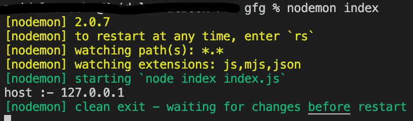

# Node.js http。ClientRequest.host API

> 原文:[https://www . geesforgeks . org/node-js-http-client request-host-API/](https://www.geeksforgeeks.org/node-js-http-clientrequest-host-api/)

**http。ClientRequest.host** 是 **http** 模块内 **ClientRequest** 类的内置 **API:应用编程接口**，用于获取客户端请求主机的对象。

**语法:**

```
const request.host
```

**参数**:本 **API** 不接受任何参数作为参数。

**返回值**:此方法返回客户端请求主机的**对象。**

**示例:**

## java 描述语言

```
// Node.js program to demonstrate the 
// request.host APi

// Importing http module
const http = require('http');

// Create an HTTP server
const server = http.createServer((req, res) => {
  res.writeHead(200, { 'Content-Type': 'text/plain' });
  res.end('okay');
});

// Now that server is running
server.listen(3000, '127.0.0.1', () => {

  // make a request
  const options = {
    port: 3000,
    host: '127.0.0.1',
    headers: {
      'Connection': 'Upgrade',
      'Upgrade': 'websocket'
    }
  };

  // getting client request
  const req = http.request(options);

  req.host='127.0.0.1'

  // getting host
  // by using host api
  const v = req.host;

  // display the result
  console.log("host :- " + v)

  process.exit(0)
});
```

**输出:**



**参考**:[https://nodejs . org/dist/latest-v 12 . x/docs/API/http . html # http _ request _ host](https://nodejs.org/dist/latest-v12.x/docs/api/http.html#http_request_host)