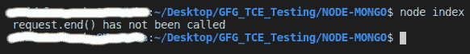

# Node.js http。client request . writableended API

> 原文:[https://www . geesforgeks . org/node-js-http-client request-writableend-API/](https://www.geeksforgeeks.org/node-js-http-clientrequest-writableended-api/)

**http。ClientRequest.writableEnded】是 http 模块内 **ClientRequest** 类的内置应用编程接口，用于检查 **request.end()** 是否被调用。**

**语法:**

```
const request.writableEnded
```

**参数**:该 API 不接受任何参数作为参数。

**返回值**:当且仅当**请求. end()被调用**时，此方法返回**真**。

**例 1:**

## index.js

```
// Node.js program to demonstrate the  
// request.writableEnded APi

// Importing http module
const http = require('http');

// Create an HTTP server
const server = http.createServer((req, res) => {
  res.writeHead(200, { 'Content-Type': 'text/plain' });
  res.end('okay');
});

// Now that server is running
server.listen(3000, '127.0.0.1', () => {

  // make a request
  const options = {
    port: 3000,
    host: '127.0.0.1',
    headers: {
      'Connection': 'Upgrade',
      'Upgrade': 'websocket'
    }
  };

  // getting client request
  const req = http.request(options);

  // checking if the request.end() has been called
  // by using writableEnded api
  if(req.writableEnded)
  console.log('request.end() has been called')
  else
  console.log('request.end() has not been called')

  process.exit(0)
});
```

**输出:**

