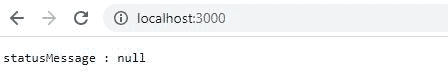

# Node.js http。进入消息状态消息方法

> 原文:[https://www . geesforgeks . org/node-js-http-incoming message-status message-method/](https://www.geeksforgeeks.org/node-js-http-incomingmessage-statusmessage-method/)

**http。传入消息.状态消息**是 [http](https://www.geeksforgeeks.org/node-js-http-module/) 模块内类传入消息的内置应用编程接口，用于获取 http 响应[状态](https://www.geeksforgeeks.org/http-status-codes-informational-responses/)消息。

**语法:**

```
message.statusMessage
```

**参数:**此方法不接受任何参数作为参数。

**返回值**:此方法返回 3 位 HTTP 响应状态码。

**示例 1:文件名:index.js**

## java 描述语言

```
// Node.js program to demonstrate the 
// request.statusMessage APi

// Importing http module
var http = require('http');

// Setting up PORT
const PORT = process.env.PORT || 3000;

// Creating http Server
var httpServer = http.createServer(
  function(request, response){

  // Getting statusMessage
  // by using request.statusMessage Api
  const value = request.statusMessage;

  // Display result
  response.end( "statusMessage : "
      + value, 'utf8', () => {
      console.log("displaying the result...");

   //Closing the server
      httpServer.close(()=>{
          console.log("server is closed")
      })
  });
});

// Listening to http Server
httpServer.listen(PORT, () => {
    console.log("Server is running at port 3000...");
});
```

**执行命令:**

```
node index.js
```

**控制台输出:**

```
Server is running at port 3000...
displaying the result...
displaying the result...
server is closed
server is closed
```

**浏览器输出:**粘贴 localhost 地址 http://localhost:3000/。在浏览器的搜索栏中。



**示例 2:文件名:index.js**

## java 描述语言

```
// Node.js program to demonstrate the 
// request.statusMessage APi

// Importing http module
var http = require('http');

// Request and response handler
const http2Handlers = (request, response) => {

  // Getting statusMessage
  // by using request.statusMessage Api
  const value = request.statusMessage;

  // Display result
  response.end( "statusMessage : "
      + value, 'utf8', () => {
      console.log("displaying the result...");

      // Closing the server
      httpServer.close(()=>{
          console.log("server is closed")
      })
  });
  };

// Creating http Server and listening
// on the 3000 port
var httpServer = http.createServer(
    http2Handlers).listen(3000, () => {
    console.log("Server is running at port 3000...");
});
```

**执行命令:**

```
node index.js
```

**控制台输出:**

```
Server is running at port 3000...
displaying the result...
displaying the result...
server is closed
server is closed
```

**浏览器输出:**粘贴 localhost 地址 http://localhost:3000/。在浏览器的搜索栏中。


**参考:**[https://nodejs . org/dist/latest-v 12 . x/docs/API/http . html # http _ message _ statusmessage](https://nodejs.org/dist/latest-v12.x/docs/api/http.html#http_message_statusmessage)