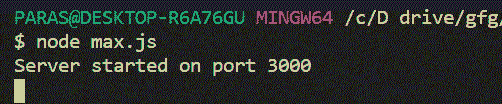
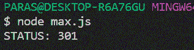

# Node.js HTTP 模块

> 原文:[https://www.geeksforgeeks.org/node-js-http-module/](https://www.geeksforgeeks.org/node-js-http-module/)

为了在 Node.js 中发出 HTTP 请求，Node.js 中有一个内置模块 **HTTP** 通过 HTTP 传输数据。要在节点中使用 HTTP 服务器，我们需要 HTTP 模块。HTTP 模块创建一个 HTTP 服务器，该服务器监听服务器端口并向客户端返回响应。

**语法:**

```js
var http = require('http');
```

我们可以借助 **http.createServer()** 方法创建一个 HTTP 服务器。

**示例 1:**
**文件名:max.js**

```js
var http = require('http');

// Create a server
http.createServer((request, response)=>{

    // Sends a chunk of the response body
    response.write('Hello World!');

    // Signals the server that all of
    // the response headers and body 
    // have been sent
  response.end();
})
.listen(3000); // Server listening on port 3000
```

**运行该程序的步骤:**使用以下命令运行该 **max.js** 文件:

```js
node max.js
```

**输出:**



通过 HTTP 模块**进行请求，使用 http.request()** 方法。

**语法:**

```js
http.request(options[, callback])
```

**示例 2:**
**文件名:max.js**

```js
var http = require('http');

var options = {
    host: 'www.geeksforgeeks.org',
    path: '/courses',
    method: 'GET'
};

// Making a get request to 
// 'www.geeksforgeeks.org'
http.request(options, (response) => {

    // Printing the statusCode
    console.log(`STATUS: ${response.statusCode}`);
}).end();
```

**运行该程序的步骤:**使用以下命令运行该 **max.js** 文件:

```js
node max.js
```

**输出:**
