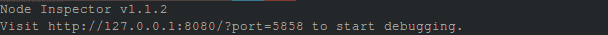

# 节点 js 检查器

> 原文:[https://www.geeksforgeeks.org/node-js-inspector/](https://www.geeksforgeeks.org/node-js-inspector/)

**node . js 中什么是检验员？**
node.js 中的 Inspector 是 node . js 应用的调试接口，包含在 app.js 文件中，使用了 blink 开发者工具。它的工作原理几乎类似于 chrome 开发工具。它可以支持调试器通常具有的几乎所有功能，例如导航到源文件、设置断点、CPU 和堆分析、网络客户端请求检查、控制台输出检查以及许多其他功能。

**如何安装？**
安装 npm(节点包管理器)后，在命令行运行以下命令即可安装。

```js
$ npm install -g node-inspector
```

在命令中，-g 标志对应于检查器的全局安装。安装后如果你运行命令节点-检查器，我们得到如下输出:



成功安装后

在上图中，它显示了一个用于调试的网址。那么，当我们把浏览器指向 *http://127.0.0.1:8080/？port=5858* ，我们得到一个用于调试的 GUI。有时，端口 8080 可能在计算机上不可用，然后我们会得到一个错误。我们可以使用以下命令更改运行节点检查器的端口(在本例中为端口 5555):

```js
$ node-inspector --web-port=5555
```

**如何开始使用？**
可以在命令行使用以下命令启动:

```js
$ node-debug app.js
```

其中 app.js 是主 JavaScript 应用程序文件的名称。可用的配置选项可以在[这里](https://github.com/node-inspector/node-inspector#configuration)看到。


调试 app.js 文件时

节点调试命令将在默认浏览器中加载节点检查器。
**注:**节点检测器只在 Chrome 和 Opera 工作。

**高级使用:**虽然运行 node-debug 是启动调试会话的简单方法，但有时我们需要调整默认设置。那么我们需要遵循下面给出的三个步骤

1.  **Start the node-inspector server:** This can be done by running command:

    ```js
    $ node-inspector
    ```

    服务器可以在后台运行，可以使用同一个服务器实例调试多个进程。

2.  **Enable debug mode in the node process:** You can either start Node with a debug flag like:

    ```js
    $ node --debug your/node/program.js
    ```

    或者，在第一行暂停脚本:

    ```js
    $ node --debug-brk your/short/node/script.js
    ```

    或者，您可以通过向已经在运行的节点发送信号来启用调试:

    1.  用你喜欢的方法得到节点进程的 PID。pgrep 或 ps -ef 都不错。

        ```js
        $ pgrep -l node
        ```

        ```js
        2345 node your/node/server.js
        ```

    2.  向它发送 USR1 信号

        ```js
        $ kill -s USR1 2345
        ```

3.  **加载调试器 UI:** 打开 *http://127.0.0.1:8080/？port=5858* 或者 Chrome 浏览器中产生的 URL。

更多细节我们可以参考[官方文档](https://github.com/node-inspector/node-inspector#node-inspector)。