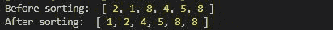
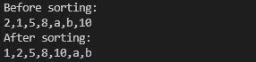
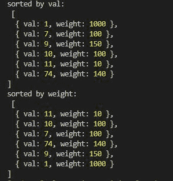

# Node.js lodash.sortBy()函数

> 原文:[https://www . geesforgeks . org/node-js-lodash-sort by-function/](https://www.geeksforgeeks.org/node-js-lodash-sortby-function/)

**Lodash** 是 Node.js 中的一个模块，工作在下划线. js 之上，Lodash 帮助处理数组、字符串、对象、数字等。 **Loadsh.sortBy()** 函数用于按升序对数组进行排序。

**语法:**

```
sortBy(collection, [iteratees=[_.identity]])
```

**参数:**该参数将集合保存为第一个参数，第二个参数可选。第二个参数基本上是一个告诉如何排序的函数。

**返回值:**返回排序后的集合。

**注意:**请在使用下面给出的代码之前，通过 **npm 安装 lodash 模块**。

**例 1:**

```
let lodash = require("lodash");
let arr = [2, 1, 8, 4, 5, 8];

console.log("Before sorting: ", arr);
console.log("After sorting: ", lodash.sortBy(arr));
```

**输出:**


**例 2:**

```
let lodash = require("lodash");
let arr = [2, 1, 5, 8, "a", "b", "10"];

console.log("Before sorting: \n" + arr);
console.log("After sorting: \n" 
        + lodash.sortBy(arr));
```

**输出:**


**例 3:**

```
let lodash = require("lodash");
let arr = [
  {val:10, weight:100},
  {val:9, weight:150},
  {val:11, weight:10},
  {val:1, weight:1000},
  {val:74, weight:140},
  {val:7, weight:100},
];

console.log("sorted by val: \n", 
  lodash.sortBy(arr, (e) => {
    return e.val
}));

console.log("sorted by weight: \n", 
  lodash.sortBy(arr, (e) => {
    return e.weight
}));
```

**输出:**
