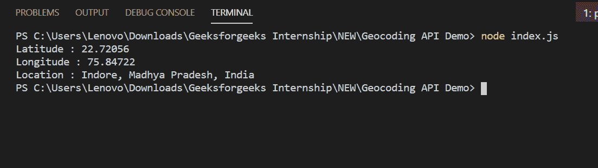

# Node.js Mapbox 正向地理编码 API

> 原文:[https://www . geesforgeks . org/node-js-mapbox-forward-geocode-API/](https://www.geeksforgeeks.org/node-js-mapbox-forward-geocoding-api/)

**正向地理编码:**正向地理编码将文本转换为地理坐标。比如把‘印多尔’变成 22.7196，75.8577。Mapbox 在地理编码应用编程接口和其他位置和地图服务中很受欢迎。

**地图框正向地理编码应用编程接口功能:**

1.  它很容易上手，也很容易使用。
2.  它将文本转换成地理坐标。

**安装请求模块:**

1.  您可以访问[安装请求模块](https://www.npmjs.com/package/request)的链接。您可以使用此命令安装此软件包。

    ```
    npm install request
    ```

2.  安装请求模块后，您可以使用命令在命令提示符下检查您的请求版本。

    ```
    npm version request
    ```

3.  现在去 [Mapbox 官方网站](https://www.mapbox.com/)创建一个账号，获取你的 API KEY。
4.  之后，您可以创建一个文件夹并添加一个文件，例如 index.js。

    ```
    node index.js
    ```

**文件名:index.js**

```
const request = require('request');
var ACCESS_TOKEN = 'YOUR_API_KEY';

const forwardGeocoding = function (address) {

    var url = 'https://api.mapbox.com/geocoding/v5/mapbox.places/'
            + encodeURIComponent(address) + '.json?access_token='
            + ACCESS_TOKEN + '&limit=1';

    request({ url: url, json: true }, function (error, response) {
        if (error) {
            callback('Unable to connect to Geocode API', undefined);
        } else if (response.body.features.length == 0) {
            callback('Unable to find location. Try to '
                     + 'search another location.');
        } else {

            var longitude = response.body.features[0].center[0]
            var latitude = response.body.features[0].center[1]
            var location = response.body.features[0].place_name

            console.log("Latitude :", latitude);
            console.log("Longitude :", longitude);
            console.log("Location :", location);
        }
    })
}

var address = 'Indore'; // Sample data

// Function call
forwardGeocoding(address);
```

**运行程序的步骤:**

1.  项目结构会是这样的:
    
2.  确保您已经使用以下命令安装了请求模块:

    ```
    npm install request
    ```

3.  Run index.js file using below command:

    ```
    node index.js
    ```

    

这就是如何使用 Mapbox 正向地理编码应用编程接口将文本转换为地理坐标。