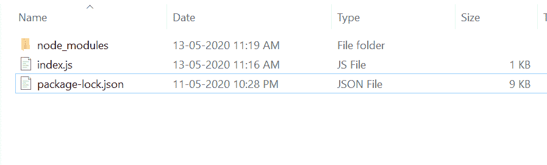
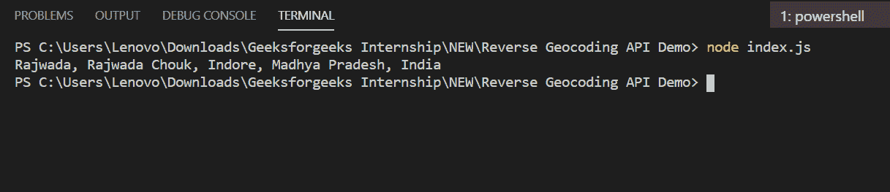

# Node.js Mapbox 反向地理编码 API

> 原文:[https://www . geesforgeks . org/node-js-mapbox-reverse-geocode-API/](https://www.geeksforgeeks.org/node-js-mapbox-reverse-geocoding-api/)

**反向地理编码:**反向地理编码将地理坐标转换为地理要素或该位置存在的要素。比如把 22.7196，75.8577 变成‘印多尔’。Mapbox 在地理编码应用编程接口和其他位置和地图服务中很受欢迎。

**Mapbox 反向地理编码 API 功能:**

1.  它很容易上手，也很容易使用。
2.  它将地理坐标转换为位置。

**安装请求模块:**

1.  您可以访问[安装请求模块](https://www.npmjs.com/package/request)的链接。您可以使用此命令安装此软件包。

    ```js
    npm install request
    ```

2.  安装请求模块后，您可以使用命令在命令提示符下检查您的请求版本。

    ```js
    npm version request
    ```

3.  现在去 [Mapbox 官方网站](https://www.mapbox.com/)创建一个账号，获取你的 API KEY。
4.  之后，您可以创建一个文件夹并添加一个文件，例如 index.js。

    ```js
    node index.js
    ```

**文件名:index.js**

```js
const request = require('request');
var ACCESS_TOKEN = 'Your_API_KEY';

const reverseGeocoding = function (latitude, longitude) {

    var url = 'https://api.mapbox.com/geocoding/v5/mapbox.places/'
            + longitude + ', ' + latitude
            + '.json?access_token=' + ACCESS_TOKEN;

    request({ url: url, json: true }, function (error, response) {
        if (error) {
            console.log('Unable to connect to Geocode API');
        } else if (response.body.features.length == 0) {
            console.log('Unable to find location. Try to'
                        + ' search another location.');
        } else {
            console.log(response.body.features[0].place_name);
        }
    })
}

// Sample data (Indore lat-long)
var latitude = 22.7196;
var longitude = 75.8577;

// Function call
reverseGeocoding(latitude, longitude);
```

**运行程序的步骤:**

1.  项目结构会是这样的:
    
2.  确保您已经使用以下命令安装了请求模块:

    ```js
    npm install request
    ```

3.  Run index.js file using below command:

    ```js
    node index.js
    ```

    

这就是如何使用地图框反向地理编码应用编程接口，将地理坐标转换为地理要素或存在于该位置的要素。