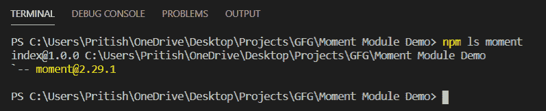
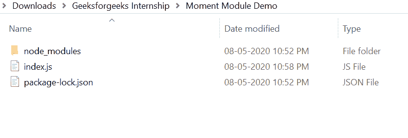
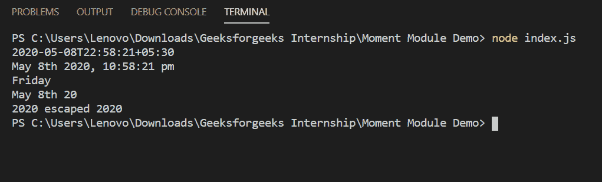

# 节点力矩模块

> 原文:[https://www.geeksforgeeks.org/node-js-moment-module/](https://www.geeksforgeeks.org/node-js-moment-module/)

矩模块用于在 JavaScript 中解析、验证、操作和显示日期和时间。

**力矩模块特性:**

1.  它很容易上手，也很容易使用。
2.  它被广泛用于格式化日期和时间。

**力矩模块安装:**

1.  您可以访问[安装力矩模块](https://www.npmjs.com/package/moment)的链接。您可以使用此命令安装此软件包。

    ```
    npm install moment
    ```

2.  After installing moment module, you can check your moment version in command prompt using the command.

    ```
    npm ls moment
    ```

    

3.  之后，您可以创建一个文件夹并添加一个文件，例如 index.js。

    ```
    node index.js
    ```

**文件名:index.js**

```
var moment = require('moment');

// 2020-05-08T22:57:42+05:30
console.log(moment().format());

// May 8th 2020, 10:56:31 pm
console.log(moment().format('MMMM Do YYYY, h:mm:ss a'));

// Friday
console.log(moment().format('dddd'));

// May 8th 20
console.log(moment().format("MMM Do YY"));

// 2020 escaped 2020 
console.log(moment().format('YYYY [escaped] YYYY'));
```

**运行程序的步骤:**

1.  项目结构会是这样的:
    
2.  使用以下命令确保您已安装力矩模块:

    ```
    npm install moment
    ```

3.  Run index.js file using below command:

    ```
    node index.js
    ```

    

这就是如何使用矩模块来解析、验证、操作和显示 JavaScript 中的日期和时间。