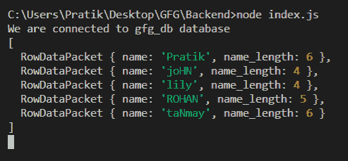
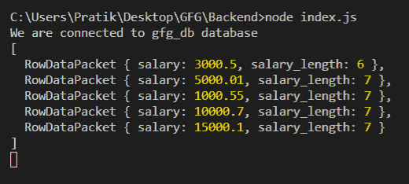

# Node.js MySQL CHAR_LENGTH()函数

> 原文:[https://www . geesforgeks . org/node-js-MySQL-char _ length-function/](https://www.geeksforgeeks.org/node-js-mysql-char_length-function/)

**CHAR_LENGTH()** 函数是 MySQL 中的内置函数，用于获取给定字符串中的多个字符。

**语法:**

```js
CHAR_LENGTH(input_string)
```

**参数:**它**取一个参数如下:**

*   **input_string** :是给定的字符串，长度待定。

**返回值:**返回给定字符串中的字符数。

**模块安装:**使用以下命令安装 **mysql** 模块:

```js
npm install mysql
```

**数据库:**我们的 SQL **发布者** 带有样本数据的表格预览如下所示:


**例 1:**

## index.js

```js
const mysql = require("mysql");

let db_con  = mysql.createConnection({
    host: "localhost",
    user: "root",
    password: '',
    database: 'gfg_db'
});

db_con.connect((err) => {
    if (err) {
      console.log("Database Connection Failed !!!", err);
      return;
    }

    console.log("We are connected to gfg_db database");

    // Here is the query
    let query = "SELECT name, CHAR_LENGTH(name) 
                AS name_length FROM publishers";

    db_con.query(query, (err, rows) => {
        if(err) throw err;

        console.log(rows);
    });
});
```

使用以下命令运行 **index.js** 文件:

```js
node index.js
```

**输出:**



**例 2:**

## index.js

```js
const mysql = require("mysql");

let db_con  = mysql.createConnection({
    host: "localhost",
    user: "root",
    password: '',
    database: 'gfg_db'
});

db_con.connect((err) => {
    if (err) {
      console.log("Database Connection Failed !!!", err);
      return;
    }

    console.log("We are connected to gfg_db database");

    // Here is the query
    let query = "SELECT salary, CHAR_LENGTH(salary) 
                AS salary_length FROM publishers";

    db_con.query(query, (err, rows) => {
        if(err) throw err;

        console.log(rows);
    });
});
```

使用以下命令运行 **index.js** 文件:

```js
node index.js
```

**输出:**

