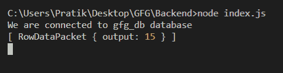

# node . js MySQL CHARACTER _ LENGTH()函数

> 原文:[https://www . geesforgeks . org/node-js-MySQL-character _ length-function/](https://www.geeksforgeeks.org/node-js-mysql-character_length-function/)

**CHARACTER_LENGTH()** 函数是 MySQL 中的一个内置函数，用于获取给定字符串中的多个字符。

**语法:**

```
CHARACTER_LENGTH(input_string)
```

**参数:**取一个参数如下:

*   **input_string** :我们会得到这个字符串的字符数。

**返回值:**返回给定字符串中的字符数。

**模块安装:**使用以下命令安装 **mysql** 模块:

```
npm install mysql
```

**数据库:**我们的 SQL **发布者** 带有样本数据的表格预览如下所示:


**例 1:**

## index.js

```
const mysql = require("mysql");

let db_con  = mysql.createConnection({
    host: "localhost",
    user: "root",
    password: '',
    database: 'gfg_db'
});

db_con.connect((err) => {
    if (err) {
      console.log("Database Connection Failed !!!", err);
      return;
    }

    console.log("We are connected to gfg_db database");

    // Here is the query
    let query = 
"SELECT CHARACTER_LENGTH('Geeks for Geeks') AS output";

    db_con.query(query, (err, rows) => {
        if(err) throw err;

        console.log(rows);
    });
});
```

使用以下命令运行 **index.js** 文件:

```
node index.js
```

**输出:**



**例 2:**

## index.js

```
const mysql = require("mysql");

let db_con  = mysql.createConnection({
    host: "localhost",
    user: "root",
    password: '',
    database: 'gfg_db'
});

db_con.connect((err) => {
    if (err) {
      console.log("Database Connection Failed !!!", err);
      return;
    }

    console.log("We are connected to gfg_db database");

    // Here is the query
    let query = 
"SELECT CHARACTER_LENGTH(name) AS name_length FROM publishers";

    db_con.query(query, (err, rows) => {
        if(err) throw err;

        console.log(rows);
    });
});
```

使用以下命令运行 **index.js** 文件:

```
node index.js
```

**输出:**

