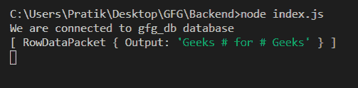
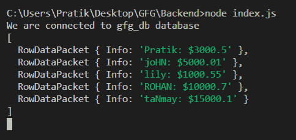

# Node.js MySQL CONCAT_WS()函数

> 原文:[https://www . geesforgeks . org/node-js-MySQL-concat _ ws-function/](https://www.geeksforgeeks.org/node-js-mysql-concat_ws-function/)

**CONCAT_WS()** 函数是 MySQL 中的一个内置函数，用于用一个常用的给定分隔符连接一组字符串。

**语法:**

```
CONCAT_WS(separator, string_1, string_2, ...)
```

**参数:**取两个参数如下:

*   **分隔符**:该分隔符将用于连接字符串。
*   **字符串**:是由逗号('，'分隔的给定输入字符串的集合。

**返回值:**它返回一个字符串，该字符串是一组具有公共给定分隔符的字符串的串联。

**模块安装:**使用以下命令安装 **mysql** 模块:

```
npm install mysql
```

**数据库:**我们的 SQL **发布者** 带有样本数据的表格预览如下所示:


**例 1:**

## index.js

```
const mysql = require("mysql");

let db_con  = mysql.createConnection({
    host: "localhost",
    user: "root",
    password: '',
    database: 'gfg_db'
});

db_con.connect((err) => {
    if (err) {
      console.log("Database Connection Failed !!!", err);
      return;
    }

    console.log("We are connected to gfg_db database");

    // Here is the query
    let query = 
"SELECT CONCAT_WS(' # ', 'Geeks', 'for', 'Geeks') AS Output";

    db_con.query(query, (err, rows) => {
        if(err) throw err;

        console.log(rows);
    });
});
```

使用以下命令运行 **index.js** 文件:

```
node index.js
```

**输出:**



**例 2:**

## index.js

```
const mysql = require("mysql");

let db_con  = mysql.createConnection({
    host: "localhost",
    user: "root",
    password: '',
    database: 'gfg_db'
});

db_con.connect((err) => {
    if (err) {
      console.log("Database Connection Failed !!!", err);
      return;
    }

    console.log("We are connected to gfg_db database");

    // Here is the query
    let query = 
"SELECT CONCAT_WS(': {content}apos;, name, salary) AS Info FROM publishers";

    db_con.query(query, (err, rows) => {
        if(err) throw err;

        console.log(rows);
    });
});
```

使用以下命令运行 **index.js** 文件:

```
node index.js
```

**输出:**

