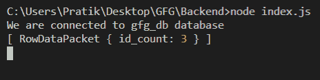
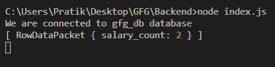

# Node.js MySQL Count()函数

> 原文:[https://www.geeksforgeeks.org/node-js-mysql-count-function/](https://www.geeksforgeeks.org/node-js-mysql-count-function/)

我们在 MySQL 中使用 COUNT()函数来计算满足 WHERE 子句的列中的行数。

**语法:**

```js
COUNT([column_name])
```

**参数:** COUNT()函数接受单个参数，如上所述，如下所述。

*   **列名:**我们必须从中返回计数值的列名。

**模块安装:**使用以下命令安装 **mysql** 模块:

```js
npm install mysql
```

**数据库:**我们的 SQL **发布者**表预览示例数据如下所示:


**示例 1:** 计数 id 大于 5 的发布者

## index.js

```js
const mysql = require("mysql");

let db_con  = mysql.createConnection({
    host: "localhost",
    user: "root",
    password: '',
    database: 'gfg_db'
});

db_con.connect((err) => {
    if (err) {
      console.log("Database Connection Failed !!!", err);
      return;
    }

    console.log("We are connected to gfg_db database");

    // Here is the query
    let query = "SELECT COUNT(id) AS id_count FROM publishers WHERE id > 5";

    db_con.query(query, (err, rows) => {
        if(err) throw err;

        console.log(rows);
    });
});
```

使用以下命令运行 **index.js** 文件:

```js
node index.js
```

**输出:**



**例 2:**

## index.js

```js
const mysql = require("mysql");

let db_con  = mysql.createConnection({
    host: "localhost",
    user: "root",
    password: '',
    database: 'gfg_db'
});

db_con.connect((err) => {
    if (err) {
      console.log("Database Connection Failed !!!", err);
      return;
    }

    console.log("We are connected to gfg_db database");

    // Here is the query
    let query = "SELECT COUNT(salary) AS salary_count FROM 
                 publishers WHERE salary BETWEEN 5000 AND 10000";

    db_con.query(query, (err, rows) => {
        if(err) throw err;

        console.log(rows);
    });
});
```

使用以下命令运行 **index.js** 文件:

```js
node index.js
```

**输出:**

