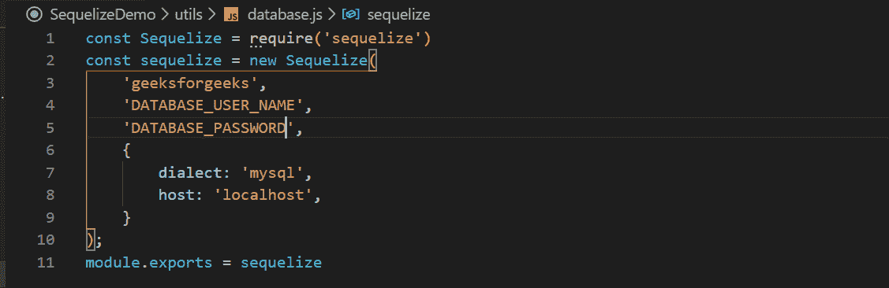
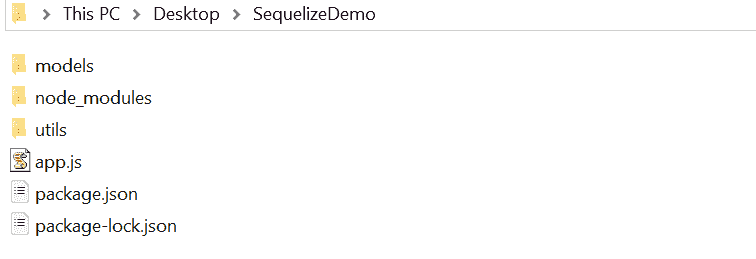
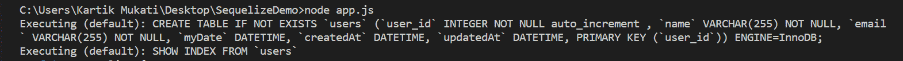
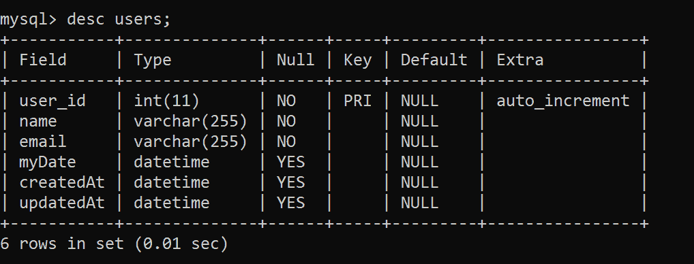

# node . js MySQL-使用 Sequelize 创建表

> 原文:[https://www . geesforgeks . org/node-js-MySQL-create-table-using-sequelize/](https://www.geeksforgeeks.org/node-js-mysql-create-table-using-sequelize/)

**Sequelize 简介:** Sequelize 是一个基于承诺的 Node.js ORM，适用于 Postgres、MySQL、MariaDB、SQLite 和微软 SQL Server。它的特点是坚实的事务支持、关系、急切和懒惰的加载、读复制等等。

**使用 Sequelize 连接到 MySql 数据库:**

*   要使用 **Sequelize** 在 MySQL 和 Node.js 之间建立连接，请访问[如何在 Node.js](https://www.geeksforgeeks.org/how-to-use-sequelize-in-node-js/) 中使用 Sequelize。
*   成功连接后，我们需要三个文件:
    1.  **SequelizeDemo > app.js** 这是我们的根文件。
    2.  **SequelizeDemo>utils>database . js**负责 MySql 连接。
    3.  **SequelizeDemo >模型> user.js** 负责定义模型。

**配置 database . js:**T2【SequelizeDemo】T4>数据库. js

*   建立连接是文章[中提到的方式如何在 Node.js](https://www.geeksforgeeks.org/how-to-use-sequelize-in-node-js/) 中使用 sequelize 现在，我们可以使用从**SequelizeDemo>utils>database . js**中导出的 Sequelize 对象来定义我们的模型。

**注意:**确保您正在使用的数据库是在您的数据库中创建的。



**配置 user.js:**

*   使用**sequelizedmo>模型> user.js** 文件定义模型和表之间的映射，使用 define 方法。

## java 描述语言

```
// Include Sequelize module.
const Sequelize = require('sequelize')

// Import sequelize object, 
// Database connection pool managed by Sequelize.
const sequelize = require('../utils/database')

// Define method takes two arguments
// 1st - name of table
// 2nd - columns inside the table
const User = sequelize.define('user', {

    // Column-1, user_id is an object with 
    // properties like type, keys, 
    // validation of column.
    user_id:{

        // Sequelize module has INTEGER Data_Type.
        type:Sequelize.INTEGER,

        // To increment user_id automatically.
        autoIncrement:true,

        // user_id can not be null.
        allowNull:false,

        // For uniquely identify user.
        primaryKey:true
    },

    // Column-2, name
    name: { type: Sequelize.STRING, allowNull:false },

    // Column-3, email
    email: { type: Sequelize.STRING, allowNull:false },

    // Column-4, default values for
    // dates => current time
    myDate: { type: Sequelize.DATE, 
            defaultValue: Sequelize.NOW },

     // Timestamps
     createdAt: Sequelize.DATE,
     updatedAt: Sequelize.DATE,
})

// Exporting User, using this constant
// we can perform CRUD operations on
// 'user' table.
module.exports = User
```

*   要了解更多关于**序列数据类型**的信息，请访问[数据类型](https://sequelize.org/v5/manual/data-types.html)。
*   在**sequelizedmo>模型> user.js** 文件中，我们已经定义了模型。

**配置 app.js:**

*   filename = >**SequelizeDemo>app . js**
*   要创建模型，我们可以使用以下方法之一-
    *   **sync()方法:**如果模型不存在，该方法将创建模型，但是，如果已经存在，它不会覆盖它。
    *   **同步({force:true})方法:**如果模型不存在，此方法将创建模型，但是，如果已经存在，它将覆盖它。

## java 描述语言

```
// Import the sequelize object on which 
// we have defined model. 
const sequelize = require('./utils/database') 

// Import the user model we have defined 
const User = require('./models/user) 

// Create all the table defined using  
// sequelize in Database 

// Sync all models that are not 
// already in the database 
sequelize.sync()  

// Force sync all models 
// It will drop the table first  
// and re-create it afterwards 
sequelize.sync({force:true})
```

*   **数据库同步:**当开始一个新项目时，你不会有数据库结构，而使用 Sequelize 时，你也不需要。只需指定您的模型结构，让库来完成剩下的工作。

**运行程序的步骤:**

*   项目结构会是这样的:



*   安装此项目所需的模块:

```
npm install mysql2
npm install sequelize
```

*   使用以下命令执行 app.js(根文件):

```
node app.js
```



*   在 MySql 数据库中，现在我们可以描述我们使用 Sequelize 创建的用户模型。使用以下命令

```
use database geeksforgeeks
desc users;
```

