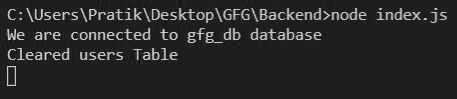
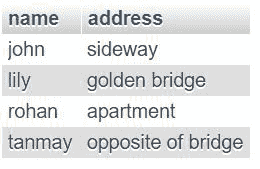
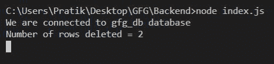

# Node.js MySQL 删除查询

> 原文:[https://www.geeksforgeeks.org/node-js-mysql-delete-query/](https://www.geeksforgeeks.org/node-js-mysql-delete-query/)

我们使用 SQL DELETE Query 从 MySQL 表中删除带有某些条件的数据。

**语法:**

*   这将删除客户表的所有行，但其他所有内容将保持原样(索引等)。

    ```
    DELETE FROM users
    ```

*   这将删除用户标识为 2 的用户表的所有行。

    ```
    DELETE FROM users WHERE userId = 2
    ```

**模块:**

*   mysql:处理 sql 连接和查询

    ```
    npm install mysql
    ```

**SQL 用户表预览:**


**示例 1:** 从用户表中删除所有行

## java 描述语言

```
const mysql = require("mysql");

let db_con  = mysql.createConnection({
    host: "localhost",
    user: "root",
    password: '',
    database: 'gfg_db'
});

db_con.connect((err) => {
    if (err) {
      console.log("Database Connection Failed !!!", err);
      return;
    }

    console.log("We are connected to gfg_db database");

    // here is our query
    let query = 'DELETE FROM users';

    db_con.query(query, (err, rows) => {
        if(err) throw err;

        console.log('Cleared users Table');
    });
});
```

**输出:**



**示例 2:** 删除所有名称为‘pratik’的用户。

*   **方法 1:** 硬编码该值

## java 描述语言

```
const mysql = require("mysql");

let db_con  = mysql.createConnection({
    host: "localhost",
    user: "root",
    password: '',
    database: 'gfg_db'
});

db_con.connect((err) => {
    if (err) {
      console.log("Database Connection Failed !!!", err);
      return;
    }

    console.log("We are connected to gfg_db database");

    // This is our Hard Coded Query
    let query = "DELETE FROM users WHERE name = 'pratik'";

    db_con.query(query, (err, rows) => {
        if(err) throw err;

        console.log('Number of rows deleted = ' + rows.affectedRows);
    });
});
```

*   **方法 2:** 动态查询

## java 描述语言

```
const mysql = require("mysql");

let db_con  = mysql.createConnection({
    host: "localhost",
    user: "root",
    password: '',
    database: 'gfg_db'
});

db_con.connect((err) => {
    if (err) {
      console.log("Database Connection Failed !!!", err);
      return;
    }

    console.log("We are connected to gfg_db database");

    // notice the ? in below query
    let query = "DELETE FROM users WHERE name = ?";

    // Dynamic Value
    let name = 'pratik';

    // Notice the name variable below
    // It will replace the ? in query
    db_con.query(query, name, (err, rows) => {
        if(err) throw err;

        console.log('Number of rows deleted = ' + rows.affectedRows);
    });
});
```

**输出:**

 