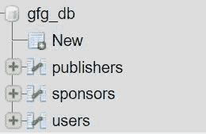

# Node.js MySQL 投递表

> 原文:[https://www.geeksforgeeks.org/node-js-mysql-drop-table/](https://www.geeksforgeeks.org/node-js-mysql-drop-table/)

删除表查询用于从 MySQL 数据库中删除或删除表。

**语法:**

*   这将删除用户表。但是，如果用户表不在那里，这将引发错误。

    ```js
    DROP TABLE users
    ```

    *   仅当用户表存在时，此操作才会将其删除。

    ```js
    DROP TABLE IF EXISTS users
    ```

    **模块:**

    *   mysql:处理 MySQL 连接和查询

        ```js
        npm install mysql
        ```

    **SQL*****gfg _ db***
    **数据库预览(显示表格):**

    

    **示例 1:** 删除用户表

    ## java 描述语言

    ```js
    const mysql = require("mysql");

    let db_con  = mysql.createConnection({
        host: "localhost",
        user: "root",
        password: '',
        database: 'gfg_db'
    });

    db_con.connect((err) => {
        if (err) {
          console.log("Database Connection Failed !!!", err);
          return;
        }

        console.log("We are connected to gfg_db database");

        // here is our query
        let query = 'DROP TABLE users';

        db_con.query(query, (err, rows) => {
            if(err) throw err;

            console.log('Deleted users Table');
        });
    });
    ```

    **输出:**

    

    **示例 2:** 仅当用户表存在时才删除用户表

    ## java 描述语言

    ```js
    const mysql = require("mysql");

    let db_con  = mysql.createConnection({
        host: "localhost",
        user: "root",
        password: '',
        database: 'gfg_db'
    });

    db_con.connect((err) => {
        if (err) {
          console.log("Database Connection Failed !!!", err);
          return;
        }

        console.log("We are connected to gfg_db database");

        // notice the if exists in below query
        let query = 'DROP TABLE IF EXISTS users';

        db_con.query(query, (err, rows) => {
            if(err) throw err;

            console.log('Deleted users Table');
        });
    });
    ```

    **输出:**

     