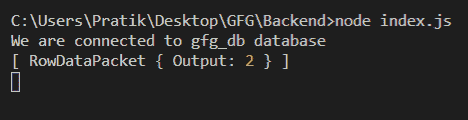

# Node.js MySQL FIELD()函数

> 原文:[https://www.geeksforgeeks.org/node-js-mysql-field-function/](https://www.geeksforgeeks.org/node-js-mysql-field-function/)

**FIELD()** 函数是 MySQL 中的内置函数，用于获取一组表达式中某个值第一次出现的位置。对于字符串值，它不区分大小写。

**语法:**

```
FIELD(value, input_1, input_2, input_3, ...)
```

**参数:**取两个参数如下:

*   **值**:是需要搜索的给定值。
*   **输入**:根据给定值检查输入是否相等。

**返回值:**返回一组表达式中某个值第一次出现的位置。如果没有发现，那么它将返回 0。

**模块安装:**使用以下命令安装 **mysql** 模块:

```
npm install mysql
```

**数据库:**我们的 SQL **发布者** 带有样本数据的表格预览如下所示:


**例 1:**

## index.js

```
const mysql = require("mysql");

let db_con  = mysql.createConnection({
    host: "localhost",
    user: "root",
    password: '',
    database: 'gfg_db'
});

db_con.connect((err) => {
    if (err) {
      console.log("Database Connection Failed !!!", err);
      return;
    }

    console.log("We are connected to gfg_db database");

    // Here is the query
    let query = "SELECT FIELD(2, 12, 15, 2, 122) AS Output";

    db_con.query(query, (err, rows) => {
        if(err) throw err;

        console.log(rows);
    });
});
```

使用以下命令运行 **index.js** 文件:

```
node index.js
```

**输出:**


**例 2:**

## index.js

```
const mysql = require("mysql");

let db_con  = mysql.createConnection({
    host: "localhost",
    user: "root",
    password: '',
    database: 'gfg_db'
});

db_con.connect((err) => {
    if (err) {
      console.log("Database Connection Failed !!!", err);
      return;
    }

    console.log("We are connected to gfg_db database");

    // Here is the query
    let query = 
"SELECT FIELD('geek', 'Geeek', 'gEEK', 'geeK') AS Output";

    db_con.query(query, (err, rows) => {
        if(err) throw err;

        console.log(rows);
    });
});
```

使用以下命令运行 **index.js** 文件:

```
node index.js
```

**输出:**

