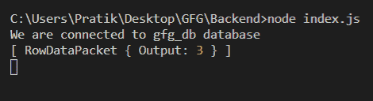
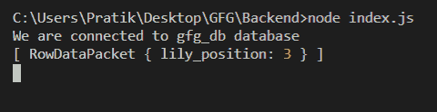

# Node.js MySQL FIND_IN_SET()函数

> 原文:[https://www . geesforgeks . org/node-js-MySQL-find _ in _ set-function/](https://www.geeksforgeeks.org/node-js-mysql-find_in_set-function/)

**FIND_IN_SET()** 函数是 MySQL 中的内置函数，用于获取值字符串在以逗号('，'分隔的字符串列表中第一次出现的位置。

**语法:**

```
FIND_IN_SET(value, list_of_string)
```

**参数:**取两个参数如下:

*   **值**:是需要搜索的值。
*   **list_of_string** :是用逗号('，')分隔的字符串列表。

**返回值:**返回值字符串在由逗号(“，”)分隔的字符串列表中第一次出现的位置

**模块安装:**使用以下命令安装 **mysql** 模块:

```
npm install mysql
```

**数据库:**我们的 SQL **发布者** 带有样本数据的表格预览如下所示:


**例 1:**

## index.js

```
const mysql = require("mysql");

let db_con  = mysql.createConnection({
    host: "localhost",
    user: "root",
    password: '',
    database: 'gfg_db'
});

db_con.connect((err) => {
    if (err) {
      console.log("Database Connection Failed !!!", err);
      return;
    }

    console.log("We are connected to gfg_db database");

    // Here is the query
    let query = "SELECT FIND_IN_SET('2', '1,12,2,32') AS Output";

    db_con.query(query, (err, rows) => {
        if(err) throw err;

        console.log(rows);
    });
});
```

使用以下命令运行 **index.js** 文件:

```
node index.js
```

**输出:**



**示例 2:** 高级示例

## index.js

```
const mysql = require("mysql");

let db_con  = mysql.createConnection({
    host: "localhost",
    user: "root",
    password: '',
    database: 'gfg_db'
});

db_con.connect((err) => {
    if (err) {
      console.log("Database Connection Failed !!!", err);
      return;
    }

    console.log("We are connected to gfg_db database");

    // Here is the query
    let sub_query = 
"(SELECT GROUP_CONCAT(name) FROM publishers)";

    let main_query = 
`SELECT FIND_IN_SET('lily', ${sub_query}) AS lily_position`;

    db_con.query(main_query, (err, rows) => {
        if(err) throw err;

        console.log(rows);
    });
});
```

使用以下命令运行 **index.js** 文件:

```
node index.js
```

**输出:**

