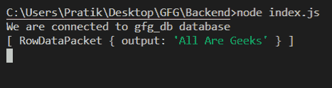

# Node.js MySQL INSERT()函数

> 原文:[https://www . geesforgeks . org/node-js-MySQL-insert-function/](https://www.geeksforgeeks.org/node-js-mysql-insert-function/)

**INSERT()** 函数是 MySQL 中的一个内置函数，用于在删除某个字符串中的某些字符后，将该字符串插入另一个字符串的某个位置。

**语法:**

```js
INSERT(string_1, position, number_of_characters_to_delete, string_2)
```

**参数:**取四个参数如下:

*   **字符串 _1** :是作为参数传递的给定主字符串。
*   **位置**:弦 _2 将在该位置插入。
*   **number _ of _ characters _ to _ delete**:是字符串 _1 中给定位置要删除的字符数。
*   **字符串 _2** :是给定的要插入的新字符串。

**返回值:**从*字符串 _1* 中删除字符，然后插入*字符串 _2* 后，返回一个新字符串。

**模块安装:**使用以下命令安装 **mysql** 模块:

```js
npm install mysql
```

**数据库:**我们的 SQL **发布者** 带有样本数据的表格预览如下所示:


**例 1:**

## index.js

```js
const mysql = require("mysql");

let db_con  = mysql.createConnection({
    host: "localhost",
    user: "root",
    password: '',
    database: 'gfg_db'
});

db_con.connect((err) => {
    if (err) {
      console.log("Database Connection Failed !!!", err);
      return;
    }

    console.log("We are connected to gfg_db database");

    // Here is the query
    let query = 
"SELECT INSERT('GeeksforGeeks', 1, 8, 'All Are ') AS output";

    db_con.query(query, (err, rows) => {
        if(err) throw err;

        console.log(rows);
    });
});
```

使用以下命令运行 **index.js** 文件:

```js
node index.js
```

**输出:**这里，前 8 个字符从位置 1–“极客”的“极客”中删除。然后插入字符串 2——“都是极客”



**例 2:**

## index.js

```js
const mysql = require("mysql");

let db_con  = mysql.createConnection({
    host: "localhost",
    user: "root",
    password: '',
    database: 'gfg_db'
});

db_con.connect((err) => {
    if (err) {
      console.log("Database Connection Failed !!!", err);
      return;
    }

    console.log("We are connected to gfg_db database");

    // Here is the query
    let query = 
"SELECT INSERT(name, 1, 0, 'Publisher - ') AS name FROM publishers";

    db_con.query(query, (err, rows) => {
        if(err) throw err;

        console.log(rows);
    });
});
```

使用以下命令运行 **index.js** 文件:

```js
node index.js
```

**输出:**

