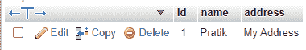
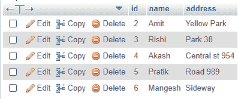

# 节点. js MySQL 插入表

> 原文:[https://www . geesforgeks . org/node-js-MySQL-insert-in-table/](https://www.geeksforgeeks.org/node-js-mysql-insert-into-table/)

**NodeJs:** 在服务器端执行 javascript 代码的开源平台。此外，一个 javascript 运行时建立在 Chrome 的 V8 JavaScript 引擎上。可以从 [<u>这里</u>](https://nodejs.org/en/) <u>下载。</u> **Mysql** 一个使用结构化查询语言(sql)的开源关系数据库管理系统(RDBMS)。它是在数据库中添加、访问和管理内容的最流行的语言。这里我们将使用 Mysql 作为节点应用程序的数据库。可以从这里的 [<u>下载。</u>](https://dev.mysql.com/downloads/mysql/5.6.html)

在本文中，我们将学习如何在 SQL INSERT Query 的帮助下，使用 Node.js 向 SQL 表中插入行。

**初始化 Node.js 项目:**

```js
npm init
```


**安装模块:**

```js
npm install express
npm install mysql
```


**文件结构:**


**MySQL 数据库结构:**

```js
gfg_db DATABASE.
gfg_table (id INT AUTO_INCREMENT PRIMARY KEY, 
  name VARCHAR(255), address VARCHAR(255)).
```

## sqlConnection.js

```js
// Importing MySQL module
const mysql = require("mysql");

// Creating connection
let db_con = mysql.createConnection({
  host: "localhost",
  user: "root",
  password: "",
  database: "gfg_db"
});

// Connect to MySQL server
db_con.connect((err) => {
  if (err) {
    console.log("Database Connection Failed !!!", err);
  } else {
    console.log("connected to Database");
  }
});

module.exports = db_con;
```

每当我们想要进行查询时，我们将在该文件中导入 ***db_con*** 模块。这将增加我们代码的模块化。

## index.js

```js
const express = require("express");
const database = require('./sqlConnection');

const app = express();

app.listen(5000, () => {
  console.log(`Server is up and running on 5000 ...`);
});

// Use Route Function from below Examples Here...

app.get("/", (req, res) => {

    // Call Route Function Here...
});
```

**示例:**

**插入单行:**下面是一个插入单行的 Route 函数。

## java 描述语言

```js
// Function to insert single row values in
// the database
let singleRowInsert = () => {

    let query = `INSERT INTO gfg_table 
        (name, address) VALUES (?, ?);`;

    // Value to be inserted
    let userName = "Pratik";
    let userAddress = "My Address";

    // Creating queries
    db_con.query(query, [userName, 
    userAddress], (err, rows) => {
        if (err) throw err;
        console.log("Row inserted with id = "
            + rows.insertId);
    });
};
```

**输出:**



**控制台输出:**

```js
Row inserted with id = 1
```

**插入多行:**下面是插入多行的 Route 函数。

## java 描述语言

```js
// Function to insert multiple Row in database
let multipleRowInsert = () => {

    // Query to insert multiple rows
    let query = `INSERT INTO gfg_table 
        (name, address) VALUES ?;`;

    // Values to be inserted
    let values = [
        ['Amit', 'Yellow Park'],
        ['Rishi', 'Park 38'],
        ['Akash', 'Central st 954'],
        ['Pratik', 'Road 989'],
        ['Mangesh', 'Sideway']
    ];

    // Executing the query
    db_con.query(query, [values], (err, rows) => {
        if (err) throw err;
        console.log("All Rows Inserted");
    });
};
```

**数据库输出:**



**控制台输出:**

```js
All Rows Inserted
```