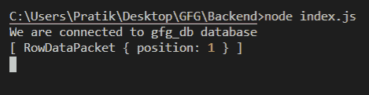
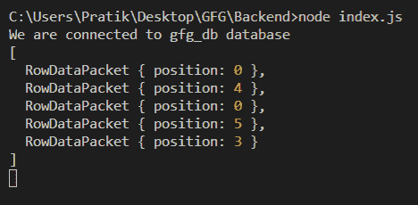

# Node.js MySQL INSTR()函数

> 原文:[https://www.geeksforgeeks.org/node-js-mysql-instr-function/](https://www.geeksforgeeks.org/node-js-mysql-instr-function/)

**INSTR()** 函数是 MySQL 中的一个内置函数，用来获取模式在文本中第一次出现的位置。

**注意:**在 NodeJs MySQL 中，INSTR()函数不区分大小写。

**语法:**

```
INSTR(text, pattern)
```

**参数:**取两个参数如下:

*   **文本**:是搜索模式的给定文本。
*   **模式**:是用户想要在文本中搜索的模式。

**返回值:**返回文本中第一次出现模式的位置号。如果没有找到匹配项，它将返回 0。

**模块安装:**使用以下命令安装 **mysql** 模块:

```
npm install mysql
```

**数据库:**我们的 SQL **发布者** 带有样本数据的表格预览如下所示:


**例 1:**

## index.js

```
const mysql = require("mysql");

let db_con  = mysql.createConnection({
    host: "localhost",
    user: "root",
    password: '',
    database: 'gfg_db'
});

db_con.connect((err) => {
    if (err) {
      console.log("Database Connection Failed !!!", err);
      return;
    }

    console.log("We are connected to gfg_db database");

    // Here is the query
    let query = 
"SELECT INSTR('GeeksForGeeks', 'geek') AS position";

    db_con.query(query, (err, rows) => {
        if(err) throw err;

        console.log(rows);
    });
});
```

使用以下命令运行 **index.js** 文件:

```
node index.js
```

**输出:**



**例 2:**

## index.js

```
const mysql = require("mysql");

let db_con  = mysql.createConnection({
    host: "localhost",
    user: "root",
    password: '',
    database: 'gfg_db'
});

db_con.connect((err) => {
    if (err) {
      console.log("Database Connection Failed !!!", err);
      return;
    }

    console.log("We are connected to gfg_db database");

    // Here is the query
    let query = 
"SELECT INSTR(name, 'n') AS position FROM publishers";

    db_con.query(query, (err, rows) => {
        if(err) throw err;

        console.log(rows);
    });
});
```

使用以下命令运行 **index.js** 文件:

```
node index.js
```

**输出:**

