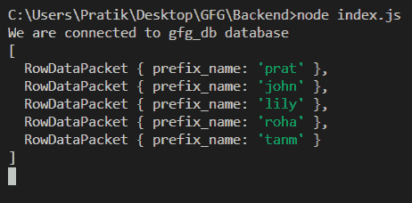
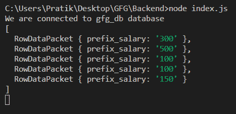

# Node.js MySQL LEFT()函数

> 原文:[https://www.geeksforgeeks.org/node-js-mysql-left-function/](https://www.geeksforgeeks.org/node-js-mysql-left-function/)

**LEFT()** 函数是 MySQL 中的一个内置函数，用于获取给定字符串特定大小的前缀。

**语法:**

```
LEFT(input_string, size_of_prefix)
```

**参数:** LEFT()函数接受两个参数，如上所述，如下所述。

*   **输入字符串:**我们将得到这个输入字符串的前缀
*   **前缀的大小:**前缀中的字符数

**返回值:** LEFT()函数返回一个字符串，该字符串是特定大小的 input_string 的前缀。

**模块:**

*   **mysql:** 处理 mysql 连接和查询

```
npm install mysql
```

**SQL 发布者表预览:**


**示例 1:** 静态查询

## java 描述语言

```
const mysql = require("mysql");

let db_con = mysql.createConnection({
  host: "localhost",
  user: "root",
  password: "",
  database: "gfg_db",
});

db_con.connect((err) => {
  if (err) {
    console.log("Database Connection Failed !!!", err);
    return;
  }

  console.log("We are connected to gfg_db database");

  // here is the query
  let query = "SELECT LEFT(name, 4) AS prefix_name FROM publishers";

  db_con.query(query, (err, rows) => {
    if (err) throw err;

    console.log(rows);
  });
});
```

**输出:**



**示例 2:** 动态查询

## java 描述语言

```
const mysql = require("mysql");

let db_con = mysql.createConnection({
  host: "localhost",
  user: "root",
  password: "",
  database: "gfg_db",
});

db_con.connect((err) => {
  if (err) {
    console.log("Database Connection Failed !!!", err);
    return;
  }

  console.log("We are connected to gfg_db database");

  // notice the ? in below query
  let query = "SELECT LEFT(salary, ?) AS prefix_salary FROM publishers";
  let sizeOfPrefix = 3;

  // notice second argument in below function
  db_con.query(query, sizeOfPrefix, (err, rows) => {
    if (err) throw err;

    console.log(rows);
  });
});
```

**输出:**

