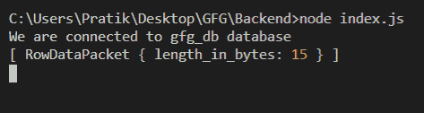
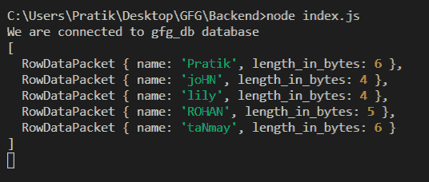

# Node.js MySQL LENGTH()函数

> 原文:[https://www . geesforgeks . org/node-js-MySQL-length-function/](https://www.geeksforgeeks.org/node-js-mysql-length-function/)

**LENGTH()** 函数是 MySQL 中的一个内置函数，用于获取给定字符串的长度(以字节为单位)。

**语法:**

```js
LENGTH(input_string)
```

**参数:** LENGTH()函数接受单个参数，如上所述，如下所述。

*   **input_string:** 我们将得到这个字符串的字符数

**返回值:** LENGTH()函数以字节为单位返回给定字符串的*长度。*

**模块:**

*   **mysql:** 处理 mysql 连接和查询

```js
npm install mysql
```

**SQL 发布者表预览:**


**例 1:**

## java 描述语言

```js
const mysql = require("mysql");

let db_con = mysql.createConnection({
  host: "localhost",
  user: "root",
  password: "",
  database: "gfg_db",
});

db_con.connect((err) => {
  if (err) {
    console.log("Database Connection Failed !!!", err);
    return;
  }

  console.log("We are connected to gfg_db database");

  // here is the query
  let query = `SELECT LENGTH('Geeks for Geeks') AS length_in_bytes`;

  db_con.query(query, (err, rows) => {
    if (err) throw err;

    console.log(rows);
  });
});
```

**输出:**



**例 2:**

## java 描述语言

```js
const mysql = require("mysql");

let db_con = mysql.createConnection({
  host: "localhost",
  user: "root",
  password: "",
  database: "gfg_db",
});

db_con.connect((err) => {
  if (err) {
    console.log("Database Connection Failed !!!", err);
    return;
  }

  console.log("We are connected to gfg_db database");

  // here is the query
  let query = `SELECT name, LENGTH(name) AS length_in_bytes FROM publishers`;

  db_con.query(query, (err, rows) => {
    if (err) throw err;

    console.log(rows);
  });
});
```

**输出:**

